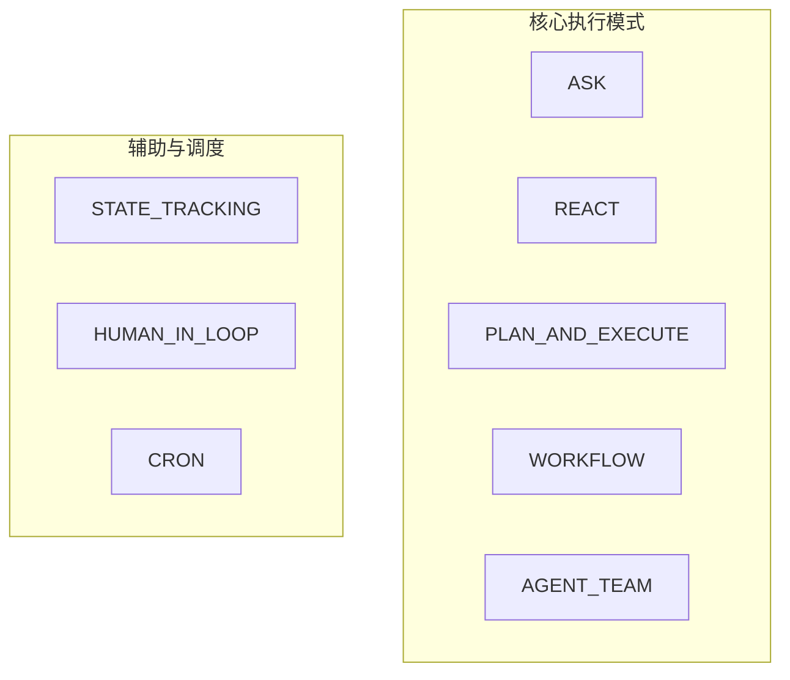

# AI智能体行动模式设计指南

## 目录

### 核心基础
1. [概述：智能体与行动模式](#1-概述智能体与行动模式)
   - [1.2.1 显式模式选择与守门（Plan / Agent Team）](#121-显式模式选择与守门plan--agent-team)
   - [1.3.1 核心执行与辅助及调度分类](#131-核心执行与辅助及调度分类)
2. [记忆管理与上下文压缩](#14-记忆管理深度剖析-memory-design)
   - [1.5 上下文压缩方案](#15-上下文压缩方案context-compression-pipeline)

### 八种核心行动模式
1. [传统对话模式（Ask）](#3-传统对话模式ask-mode)
2. [思考行动模式（ReAct）](#4-思考行动模式react)
   - [4.7 ReWOO：免观察推理模式](#47-rewoo免观察推理模式-reason-without-observation)
3. [计划执行模式（Plan-and-Execute）](#5-计划执行模式plan-and-execute)
4. [工作流模式（Workflow）](#6-工作流模式workflow)
   - [6.7 Reflection：反思与自我修正](#67-反思与自我修正模式-reflection--self-correction)
5. [智能体团队模式（Agent Team）](#7-智能体团队模式agent-team)
6. [定时任务模式（Cron）](#8-定时任务模式cronscheduled)
7. [状态追踪模式（State Tracking）](#9-状态追踪模式state-tracking)
8. [人在环模式（Human-in-the-Loop）](#10-人在环模式human-in-the-loop)

### 模式组合与生态
1. [行动模式灵活搭配](#11-行动模式灵活搭配)
2. [知名智能体平台分析](#12-知名智能体平台行动模式分析)

### 横向能力模块
1. [多模态交互与Computer Use](#13-多模态交互与计算机使用)

---

## 1. 概述：智能体与行动模式

### 1.1 什么是AI智能体（Agent）

AI智能体（Agent）是一种能够感知环境、进行推理、制定计划并执行行动的人工智能系统。基于大语言模型（LLM）的Agent将LLM作为"大脑"，结合规划、记忆和工具使用能力，实现自主完成任务的目标。

**Agent的核心公式**：
```
Agent = LLM（大模型）+ 规划（Planning）+ 记忆（Memory）+ 工具使用（Tool Use）
```

### 1.2 行动模式的重要性

行动模式决定了Agent如何：
- 接收和理解用户输入
- 分解和规划任务
- 调用工具执行操作
- 处理执行结果
- 反馈给用户

选择合适的行动模式直接影响系统的**效率、准确性、成本和可维护性**。

### 1.2.1 显式模式选择与守门（Plan / Agent Team）

**JinGu3 产品规范**：即使用户在客户端**显式选择**「计划执行（Plan-and-Execute）」或「智能体团队（Agent Team）」，系统在当轮仍须进行**意图与场景识别**（可与自动模式路由共用同一套分类/规则，或由独立守门组件完成，工程实现见路线图）。若判定当前输入**不适合**该重型模式（例如简单事实问答、无需多步计划或多角色协作），则**实际执行降级为 Ask**（直接作答路径），且在**首条或紧随其后的回复**中向用户**简要说明原因**；不得静默仍跑完整计划或多 Agent 流程。与 [§1.3.1](#131-核心执行与辅助及调度分类) 及本章 [§5](#5-计划执行模式plan-and-execute)、[§7](#7-智能体团队模式agent-team) 首段说明一致。

### 1.3 八种行动模式一览

| 序号 | 模式名称 | 英文名 | 核心思想 | 复杂度 |
|:----:|----------|--------|----------|:------:|
| 1 | 传统对话模式 | Ask Mode | 直接调用工具回答 | ⭐ |
| 2 | 思考行动模式 | ReAct | 思考→行动→观察循环 | ⭐⭐⭐ |
| 3 | 计划执行模式 | Plan-and-Execute | 先规划后执行 | ⭐⭐⭐⭐ |
| 4 | 工作流模式 | Workflow | 预设流程节点协作 | ⭐⭐⭐ |
| 5 | 智能体团队模式 | Agent Team | 主Agent拆解+子Agent执行 | ⭐⭐⭐⭐⭐ |
| 6 | 定时任务模式 | Cron/Scheduled | 定时触发+主动服务 | ⭐⭐⭐ |
| 7 | 状态追踪模式 | State Tracking | 小模型异步管状态 | ⭐⭐⭐⭐ |
| 8 | 人在环模式 | Human-in-the-Loop | 人类参与决策审批 | ⭐⭐⭐ |

### 1.3.1 核心执行与辅助及调度分类

为与 **JinGu3 工程实现**（`ActionMode` 枚举、`ActionModePolicy` 对话 API 策略）及**目标产品形态**对齐，八种模式在架构上可分为：**核心执行模式**（该模式下一次请求路径中会调用 LLM 完成推理或编排）与**辅助及调度向能力**（工程内对应 Handler 通常**不**调用 LLM；其中 Cron 的真调度依赖库表与定时器，而非对话 Handler 本身）。

#### 八大模式分类（示意）

```text
┌─────────────────────────────────────────────────────────────────────────┐
│ 八大 ActionMode 分类                                                     │
├─────────────────────────────────────────────────────────────────────────┤
│  【核心执行】（路径上独立调用 LLM）    【辅助/调度】（占位 Handler 不调 LLM）   │
│  ASK / REACT / PLAN_AND_EXECUTE       STATE_TRACKING（跨轮次状态/DST）        │
│  WORKFLOW / AGENT_TEAM                HUMAN_IN_LOOP（人在环断点）            │
│                                       CRON（真调度：库表 + 定时器，见 §8.0）    │
└─────────────────────────────────────────────────────────────────────────┘
```



#### 对话 HTTP API 边界

面向 `/chat` 等对话接口，**仅允许用户显式选择五种核心模式**（ASK、REACT、PLAN_AND_EXECUTE、WORKFLOW、AGENT_TEAM）。`CRON`、`STATE_TRACKING`、`HUMAN_IN_LOOP` **不得**作为普通「聊天模式」下拉误选（与产品边界一致）。工程校验见服务端 `ActionModePolicy`。

#### 辅助能力：当前实现 vs 规范目标（摘要）

详细展开见 **§8.0**、**§9.0**、**§10.0** 及对应正文章节。

- **STATE_TRACKING / DST**：当前仓库实现为按 `conversationId` 的进程内**计数器**，**不是**业界意义上的 **Dialogue State Tracking**。规范目标：在 Ask / ReAct / Plan-and-Execute / Agent Team 等路径中，由大模型或小模型**门控是否发起**结构化状态追踪；追踪中维护可展示、可版本化的状态，到达检查点或完成后以**卡片**请用户**核对/定稿**（与 HITL「行动授权」卡片**语义区分**）；**右侧分屏子页**展示进度，支持用户**修订并确认**、回注会话（持久化与 API 见路线图）。
- **HUMAN_IN_LOOP**：当前为枚举值 + `HumanInLoopModeHandler`，仅返回待审批**说明文案**。规范形态为**嵌入**核心执行路径的断点：由模型在当轮判断是否需要人工介入，通过**卡片**暂停等待确认/拒绝，**同一会话续跑**；**不是**用户单独切换的「第八种聊天模式」。业界常见对应：工作流人工节点、工具审批门、执行图 interrupt/resume 等。
- **CRON**：当前 Handler 为**演示模板**。规范目标：**简单定时器框架**周期性判断到期任务；**任务定义落数据库**；创建方式包括（1）用户通过**定时任务产品入口**（2）对话中模型调用**创建定时任务**类工具；作用域分为**全局**与**会话**（绑定 `conversationId` 等）。与「聊天接口不选 CRON」并存。

#### 显式 Plan / Agent Team 守门

见 [§1.2.1](#121-显式模式选择与守门plan--agent-team)。

---

## 1.4 记忆管理深度剖析 (Memory Design)

### 1.4.1 记忆分层架构

Agent的记忆系统是实现上下文理解、个性化服务和持续学习的基础。

```
┌─────────────────────────────────────────────────────────────────┐
│                      Agent 记忆分层架构                          │
├─────────────────────────────────────────────────────────────────┤
│                                                                 │
│  ┌─────────────────────────────────────────────────────────┐    │
│  │                   长期记忆 (LTM)                          │    │
│  │  ┌────────────┐ ┌────────────┐ ┌────────────┐          │    │
│  │  │ 知识图谱   │ │ 向量数据库 │ │ 用户画像   │          │    │
│  │  │ (Graph)   │ │ (Vector)   │ │ (Profile)  │          │    │
│  │  └────────────┘ └────────────┘ └────────────┘          │    │
│  │  跨会话持久化、全局知识、可检索历史                         │    │
│  └─────────────────────────────────────────────────────────┘    │
│                          ▲                                      │
│                          │                                      │
│  ┌─────────────────────────────────────────────────────────┐    │
│  │                   情节记忆 (Episodic)                    │    │
│  │  ┌────────┐ ┌────────┐ ┌────────┐ ┌────────┐          │    │
│  │  │Session1│ │Session2│ │Session3│ │Session4│          │    │
│  │  └────────┘ └────────┘ └────────┘ └────────┘          │    │
│  │  State Tracking历史轨迹、任务复盘、经验总结                 │    │
│  └─────────────────────────────────────────────────────────┘    │
│                          ▲                                      │
│                          │                                      │
│  ┌─────────────────────────────────────────────────────────┐    │
│  │                   短期记忆 (STM)                          │    │
│  │                                                          │    │
│  │   [用户输入] → [思考过程] → [工具调用] → [最终输出]        │    │
│  │                                                          │    │
│  │   当前会话上下文、对话历史、工作内存                        │    │
│  └─────────────────────────────────────────────────────────┘    │
│                                                                 │
└─────────────────────────────────────────────────────────────────┘
```

### 1.4.2 三层记忆详解

| 层级 | 存储介质 | 生命周期 | 容量 | 用途 |
|------|----------|----------|------|------|
| **短期记忆(STM)** | 内存变量 | 当前会话 | 有限(上下文窗口) | 当前任务处理 |
| **情节记忆(Episodic)** | 数据库/文件 | 跨会话 | 可扩展 | State Tracking历史 |
| **长期记忆(LTM)** | Vector DB/Graph | 持久化 | 无限 | 知识库、用户画像 |

### 1.4.3 记忆截断策略（防止Token溢出）

当ReAct等循环模式运行超过N步时，需要总结前半段历史：

```python
class MemoryManager:
    """记忆管理器"""
    
    def __init__(self, max_context_length: int = 8000):
        self.max_context_length = max_context_length
        self.short_term: List[Dict] = []
        self.episodic: List[Dict] = []
        self.long_term_vector = None
    
    def add(self, item: Dict):
        """添加记忆"""
        self.short_term.append(item)
        
        # 检查是否需要截断
        if self._estimate_length() > self.max_context_length:
            self._compress()
    
    def _estimate_length(self) -> int:
        """估算当前上下文长度"""
        return sum(len(str(item)) for item in self.short_term)
    
    def _compress(self):
        """压缩记忆 - 总结前半段"""
        if len(self.short_term) < 4:
            return
        
        # 保留最近2个记忆
        recent = self.short_term[-2:]
        
        # 总结前半段
        old_memories = self.short_term[:-2]
        summary = self._summarize(old_memories)
        
        # 存储到情节记忆
        self.episodic.append({
            "type": "compressed_summary",
            "summary": summary,
            "count": len(old_memories)
        })
        
        # 保留摘要和最近记忆
        self.short_term = [{"type": "summary", "content": summary}] + recent
    
    def _summarize(self, memories: List[Dict]) -> str:
        """使用LLM总结记忆"""
        prompt = f"请总结以下对话要点，保持关键信息：\n{memories}"
        # 调用LLM生成摘要
        return llm.invoke(prompt)
    
    def retrieve(self, query: str, top_k: int = 5) -> List[Dict]:
        """检索相关记忆"""
        results = []
        
        # 1. 短期记忆（最近优先）
        results.extend(self.short_term[-top_k:])
        
        # 2. 情节记忆（语义检索）
        if self.episodic:
            episodic_results = self._vector_search(self.episodic, query, top_k)
            results.extend(episodic_results)
        
        return results


# 使用示例
memory = MemoryManager(max_context_length=8000)

# 在ReAct循环中使用
def react_with_memory(agent, task):
    context = []
    
    while not agent.is_complete():
        # 添加历史到记忆
        for item in agent.execution_history[-5:]:
            memory.add(item)
        
        # 检索相关记忆作为上下文
        relevant = memory.retrieve(task, top_k=3)
        context = relevant + agent.get_current_state()
        
        # 继续执行
        agent.step(context)
```

### 1.4.4 RAG检索增强

长期记忆通过向量检索实现：

```python
class LongTermMemory:
    """长期记忆系统"""
    
    def __init__(self, vector_store):
        self.vector_store = vector_store  # FAISS/Pinecone/Milvus
    
    def store(self, content: str, metadata: Dict = None):
        """存储到向量数据库"""
        embedding = self.get_embedding(content)
        self.vector_store.add(
            ids=[str(uuid.uuid4())],
            embeddings=[embedding],
            documents=[content],
            metadatas=[metadata or {}]
        )
    
    def retrieve(self, query: str, top_k: int = 5) -> List[Dict]:
        """语义检索"""
        query_embedding = self.get_embedding(query)
        results = self.vector_store.search(
            query_embeddings=[query_embedding],
            n_results=top_k
        )
        return [
            {"content": doc, "metadata": meta}
            for doc, meta in zip(results["documents"], results["metadatas"])
        ]
    
    def get_embedding(self, text: str) -> List[float]:
        """获取文本嵌入"""
        # 使用OpenAI/Cohere等embedding模型
        return embedding_model.encode(text)
```

### 1.4.5 记忆设计最佳实践

| 场景 | 推荐策略 | 说明 |
|------|----------|------|
| 客服对话 | STM + LTM(RAG) | 实时上下文 + 历史知识库 |
| 个人助手 | STM + Episodic + LTM | 三层全用 |
| 数据分析 | STM + Episodic | State Tracking复盘 |
| 代码助手 | STM | 极简记忆，减少干扰 |

---

## 1.5 上下文压缩方案（Context Compression Pipeline）

### 1.5.1 核心概念与定位

**上下文压缩**与**记忆管理**是两个不同的问题：

| 维度 | 上下文压缩（本章重点） | 记忆管理 |
| :--- | :--- | :--- |
| **核心问题** | 单次会话过长，超出模型上下文窗口 | 跨会话记住用户偏好、历史决策 |
| **触发时机** | 实时，当 Token 接近窗口上限时 | 异步，会话结束后或后台轮询 |
| **典型方案** | 摘要、裁剪、外存、Token 剪枝 | 向量库持久化、结构化用户画像 |
| **工程目标** | 防止 API 报错，维持任务连续性 | 个性化体验，长期知识积累 |

本章聚焦于**上下文压缩**——当 Agent 执行长时任务时，如何在不丢失关键信息的前提下，将上下文控制在模型 Token 限制内。

### 1.5.2 主流框架方案对比

| 框架 | 压缩触发条件 | 核心机制 | 特色能力 |
| :--- | :--- | :--- | :--- |
| **Claude Code** | 自动触发（~95% 窗口占用，约 190K tokens） | LLM 结构化摘要 + 工具输出清除 + CLAUDE.md 持久化 | `/compact` 命令支持自定义保留指令；子 Agent 隔离上下文 |
| **LangChain Deep Agents** | 三层阈值：大工具结果（>20K tokens）即时外存；>85% 窗口时裁剪旧工具输入；>95% 时摘要 | 文件系统外存 + 工具调用参数裁剪 + 结构化摘要 | 三层递进策略，摘要前先尝试外存和裁剪，最大限度保留原始信息 |
| **DeerFlow 2.0** | 可配置触发策略：绝对 Token 数 / 消息条数 / 窗口比例 | 摘要中间件（SummarizationMiddleware）+ 两阶段压缩 | 14 层有序中间件链，压缩逻辑可精细配置 |
| **OpenClaw** | 自动触发（接近窗口上限时） | 摘要式压缩 + 可插拔 ContextEngine 接口 | 压缩策略完全由插件接管 |
| **Cursor** | 截断旧历史 | 直接丢弃最老消息 | 极简，但可能丢失关键上下文 |
| **OpenAI Codex** | 每轮对话后服务端压缩 | 黑盒压缩（`/responses/compact` 端点） | 不可见、不可控，但零配置 |

### 1.5.3 核心压缩技术分类

#### 1.5.3.1 LLM 摘要压缩（LLM Summarization）

- **原理**：调用 LLM 将完整对话历史压缩为结构化摘要，替换原始内容。
- **代表实现**：Claude Code 的 Auto-Compact（将对话组织为"已完成工作、当前状态、待办任务、文件修改、关键决策"等章节）
- **压缩率**：70%-90%
- **优缺点**：能理解语义、保留关键决策；但速度慢，有摘要失真风险

#### 1.5.3.2 直接丢弃/截断（Truncation）

- **原理**：保留最近 N 条消息，超出部分直接丢弃
- **代表实现**：Cursor 的旧历史截断
- **优缺点**：零成本、零延迟；但可能丢失关键上下文

#### 1.5.3.3 裁剪/外存（Offloading）

- **原理**：将大块工具输出或文件内容存储到文件系统，上下文中仅保留文件路径引用
- **代表实现**：LangChain Deep Agents 的大工具结果外存（>20K tokens 时自动写入文件）
- **优缺点**：不丢失原始信息；但增加 I/O 操作

#### 1.5.3.4 Token 级剪枝（Token Pruning）

- **原理**：使用小模型计算每个 Token 的"信息熵"，删除低信息量 Token
- **代表实现**：微软 LLMLingua（计算 perplexity）
- **压缩率**：2x-20x
- **优缺点**：极快（3-6x）；但可能破坏代码语法

#### 1.5.3.5 观察掩码（Observation Masking）

- **原理**：工具返回的完整输出在上下文中用占位符替代，仅当 Agent 需要时才展开
- **优缺点**：零成本、保留检索能力；但需框架支持懒加载

#### 1.5.3.6 子 Agent 上下文隔离（Subagent Isolation）

- **原理**：将搜索、文件读取等任务委派给独立子 Agent，子 Agent 在隔离的上下文窗口中执行，只返回最终结果
- **代表实现**：Claude Code 的子 Agent 隔离机制
- **优缺点**：主 Agent 上下文始终干净；但调度复杂度高

### 1.5.4 方案选型决策框架

```
开始
  │
  ├─ 任务类型是？
  │     │
  │     ├─ 代码生成 / 代码编辑？
  │     │     │
  │     │     ├─ 需要高精度保留语法？ → 子 Agent 隔离 + 文件外存
  │     │     │                         （⭐ Claude Code / Deep Agents 模式）
  │     │     │
  │     │     └─ 预算有限、快速迭代？ → 摘要压缩 + /compact 命令
  │     │                               （⭐ Claude Code 风格）
  │     │
  │     ├─ 长文档问答 / RAG？
  │     │     │
  │     │     └─ → Token 剪枝（LLMLingua）+ 外存
  │     │          （⭐ 高压缩率，保留语义）
  │     │
  │     └─ 简单对话助手？
  │           └─ → 直接截断 / 消息丢弃
  │                （⭐ 零成本，足够用）
  │
  └─ 实施复杂度是？
        │
        ├─ 快速接入？ → 框架自带压缩（DeerFlow 2.0 / LangChain Deep Agents）
        │
        └─ 深度定制？ → 可插拔引擎（OpenClaw ContextEngine）
```

### 1.5.5 关键工程实践

#### 1.5.5.1 LangChain Deep Agents 三层压缩配置

```python
from deepagents import create_deep_agent

# Deep Agents 内置三层压缩策略，开箱即用
agent = create_deep_agent(
    model="claude-sonnet-4-6",
    system_prompt="你是一个代码助手，擅长长时任务",
    # 内置压缩行为（无需显式配置）：
    # 1. 大工具结果 (>20K tokens) → 自动外存到文件系统
    # 2. >85% 窗口 → 裁剪旧工具调用参数
    # 3. >95% 窗口 → LLM 结构化摘要
)
```

#### 1.5.5.2 Claude Code 风格手动压缩

```bash
# 基础压缩（通用摘要）
/compact

# 带保留指令的压缩（推荐）
/compact preserve all file paths, the auth middleware changes, and current test failures

# 聚焦特定工作的压缩
/compact focus on the API refactoring in src/routes/ and the migration plan
```

#### 1.5.5.3 LLMLingua Token 级剪枝

```python
from llmlingua import PromptCompressor

llm_lingua = PromptCompressor()
compressed = llm_lingua.compress_prompt(
    prompt="大量文本...",
    instruction="回答问题",
    target_token=200
)
# 返回：{'compressed_prompt': '...', 'origin_tokens': 2365, 
#        'compressed_tokens': 211, 'ratio': '11.2x'}
```

### 1.5.6 注意事项与常见陷阱

| 陷阱 | 说明 | 解决方案 |
| :--- | :--- | :--- |
| **摘要在代码场景中的风险** | LLM 摘要会丢失精确的文件路径、行号、错误栈信息 | 将关键路径写入 CLAUDE.md 等持久化文件 |
| **Token 剪枝破坏代码语法** | LLMLingua 等方法对代码（括号配对、缩进结构）可能造成破坏 | 代码场景优先使用子 Agent 隔离或文件外存 |
| **过度依赖自动压缩** | 在任务关键节点压缩可能导致重要状态丢失 | 最佳实践是手动在任务断点处主动压缩 |
| **压缩与记忆的混淆** | 压缩不负责跨会话的记忆持久化 | 需要独立的 Memory 系统 |

### 1.5.7 方案总结

| 方案 | 适用场景 | 核心优势 | 核心风险 |
| :--- | :--- | :--- | :--- |
| **LLM 摘要压缩** | 长对话、多轮任务 | 语义理解，保留关键决策 | 慢、可能丢失精确细节 |
| **直接截断** | 简单对话、成本敏感 | 零成本、零延迟 | 丢失旧上下文 |
| **文件外存** | 代码生成、大文件处理 | 不丢原始信息 | 需文件系统支持 |
| **Token 剪枝** | RAG、长文档问答 | 极快、压缩率高 | 可能破坏代码语法 |
| **观察掩码** | 大量工具调用场景 | 零成本、可检索 | 需框架懒加载支持 |
| **子 Agent 隔离** | 多阶段搜索/分析任务 | 主上下文始终干净 | 调度复杂度高 |

**一句话总结**：没有一种压缩方案是完美的。生产级 Agent 应组合使用多种策略——子 Agent 隔离处理"脏活"，文件外存保存大块内容，LLM 摘要在必要时压缩历史——并在任务逻辑断点处主动触发压缩。

---

## 2. 模式总览与对比

### 2.1 核心维度对比表

| 维度 | Ask | ReAct | Plan | Workflow | Agent Team | Cron | State | HiT |
|------|:---:|:-----:|:----:|:--------:|:-----------:|:----:|:-----:|
| **复杂度** | 低 | 中 | 高 | 中 | 高 | 中 | 高 |
| **响应速度** | 快 | 中 | 较慢 | 中 | 慢 | 触发时 | 异步 |
| **规划能力** | 无 | 实时 | 全局 | 预设 | 动态 | 无 | 无 |
| **工具调用** | 1次 | 多次循环 | 多次+规划 | 节点配置 | 多Agent | 定时触发 | 状态管理 |
| **错误处理** | 无 | 实时调整 | 重规划 | 节点容错 | 失败转移 | 重试 | 状态回滚 |
| **适用任务** | 简单 | 中等 | 复杂 | 固定流程 | 多领域 | 周期性 | 长时/批量 |
| **Token消耗** | 低 | 中 | 高 | 中 | 高 | 按需 | 低 |
| **实施难度** | ⭐ | ⭐⭐⭐ | ⭐⭐⭐⭐ | ⭐⭐⭐ | ⭐⭐⭐⭐⭐ | ⭐⭐⭐ | ⭐⭐⭐⭐ |

### 2.2 架构复杂度对比

```
Ask          │  ○ → ○
             │
ReAct        │  ○ → ⟳ → ○ → ⟳ → ○
             │       ↑____________|
             │
Plan         │  ○ → [□计划] → □ → □ → □ → ○
             │          ↑_____↻_|  (重规划)
             │
Workflow     │  ○ → [□] → [□] → [□] → ○
             │        ↓    ↓    ↑
             │      并行  并行  汇聚
             │
Agent Team   │  ○ → [👤Leader] → 👤 → 👤 → 👤 → ○
             │              ↓___↑↓___↑
             │               Workers
             │
Cron         │  ⏰ → ○ → (后台执行) → 📬
             │      定时触发
             │
State        │  ○ → [📊StateTable] ← 👁️Tracker
             │      ↑_________________│
             │         异步更新
```

### 2.3 选型决策树

```
开始
  │
  ├─ 任务类型是？
  │     │
  │     ├─ 简单查询？ → Ask模式 ⭐推荐
  │     │
  │     ├─ 周期性任务？ → Cron模式
  │     │
  │     ├─ 固定流程？ → Workflow模式
  │     │
  │     └─ 复杂任务？
  │           │
  │           ├─ 需要实时调整？ → ReAct模式
  │           │
  │           └─ 需要全局规划？ → Plan模式
  │
  └─ 系统规模是？
        │
        ├─ 单Agent足够？ → ReAct / Plan
        │
        └─ 需要多领域协作？ → Agent Team + State Tracking
```

---

## 3. 传统对话模式（Ask Mode）

### 3.1 模式原理

Ask模式是最基础的Agent交互方式，用户提出问题，Agent直接调用查询工具获取信息并回答。**只调用工具，不进行复杂推理**。

### 3.2 架构流程图

```
┌─────────────┐
│   用户输入   │
└──────┬──────┘
       │
       ▼
┌─────────────┐
│  Agent接收  │  ← LLM理解用户意图
└──────┬──────┘
       │
       ▼
┌─────────────┐     ┌─────────────┐
│ 工具选择器  │ ──→ │  查询工具   │
│ (Router)   │     │ (Search/DB) │
└──────┬─────┘     └──────┬──────┘
       │                  │
       │                  ▼
       │            ┌─────────────┐
       └──────────→ │  返回结果   │
                    └──────┬──────┘
                           │
                           ▼
                    ┌─────────────┐
                    │   答案输出   │
                    └─────────────┘
```

### 3.3 方案对比

| 方案 | 特点 | 适用场景 | 局限 |
|------|------|----------|------|
| **基础Ask** | 单轮问答，直接返回 | 简单事实查询 | 无法处理复杂问题 |
| **多轮Ask** | 支持上下文对话 | 简单对话助手 | 无推理能力 |
| **路由Ask** | 增加意图分类路由 | 多类型查询入口 | 需要维护分类器 |

### 3.4 Python伪代码

```python
from langchain_openai import ChatOpenAI
from langchain.tools import tool
from typing import Optional, List

class AskAgent:
    """传统对话模式Agent"""
    
    def __init__(self, model_name: str = "gpt-4"):
        self.llm = ChatOpenAI(model=model_name, temperature=0)
        self.tools = {}
        self.router_prompt = """根据用户问题类型选择工具：
        - 天气查询 → weather_tool
        - 数学计算 → calculator_tool
        - 实时信息 → search_tool
        - 知识问答 → knowledge_tool
        - 无需工具 → direct_answer"""
    
    def register_tool(self, name: str, func: callable, description: str):
        """注册工具"""
        self.tools[name] = {
            "func": func,
            "description": description
        }
    
    def select_tool(self, query: str) -> Optional[str]:
        """选择合适工具"""
        response = self.llm.invoke(f"{self.router_prompt}\n\n用户问题：{query}")
        # 解析返回的工具名
        return self._parse_tool_name(response.content)
    
    def run(self, query: str) -> str:
        """执行问答"""
        # 1. 选择工具
        tool_name = self.select_tool(query)
        
        # 2. 调用工具或直接回答
        if tool_name and tool_name in self.tools:
            tool_result = self.tools[tool_name]["func"](query)
            return f"{tool_result}"
        else:
            # 无需工具的直接回答
            return self.llm.invoke(query)
    
    def run_with_context(self, query: str, history: List[str]) -> str:
        """带上下文的多轮对话"""
        context = "\n".join(history[-5:])  # 最近5轮
        full_prompt = f"对话历史：\n{context}\n\n当前问题：{query}"
        return self.run(full_prompt)


# 使用示例
agent = AskAgent()

# 注册工具
agent.register_tool("search", search_web, "搜索网络信息")
agent.register_tool("weather", get_weather, "查询天气")
agent.register_tool("calculator", calculate, "数学计算")

# 执行
result = agent.run("北京今天多少度？")
print(result)  # 输出天气信息
```

### 3.5 适用场景

**✅ 适合**：
- 简单事实查询（"Python是什么？"）
- 天气/股票查询（实时信息获取）
- 单轮知识问答（基础知识库）
- 资源敏感场景（控制Token消耗）

**❌ 不适合**：
- 多步骤复杂任务
- 需要推理链的问题
- 开放式创作任务
- 需要自我修正的场景

### 3.6 参考资料

- 论文：Self-Ask模式 (Microsoft Research, 2022)
- LangChain Agents: ZERO_SHOT_REACT_DESCRIPTION

---

## 4. 思考行动模式（ReAct）

### 4.1 模式原理

**ReAct = Reasoning + Acting**，由清华大学和Google Research在2022年提出。通过"思考→行动→观察"的循环迭代，让Agent在执行任务时交替进行推理和行动。

**核心循环**：
```
思考(Thought) → 行动(Action) → 观察(Observation) → 思考(Thought) → ...
```

### 4.2 架构流程图

```
┌──────────────────────────────────────────────────────────────┐
│                     ReAct 循环执行流程                        │
├──────────────────────────────────────────────────────────────┤
│                                                              │
│    ┌──────────┐                                             │
│    │  思考    │  "我需要先搜索相关信息"                       │
│    │ Thought  │                                             │
│    └────┬─────┘                                             │
│         │                                                   │
│         ▼                                                   │
│    ┌──────────┐     ┌─────────────────────────────────┐   │
│    │  行动    │ ──→ │         工具调用                  │   │
│    │  Action  │     │  ┌─────────┬─────────┬─────────┐ │   │
│    │          │     │  │ Search  │  API    │  File   │ │   │
│    │          │     │  │  Tool   │  Tool   │  Tool   │ │   │
│    │          │     │  └─────────┴─────────┴─────────┘ │   │
│    └────┬─────┘     └─────────────────────────────────┘   │
│         │                        ││
│         │                        ▼                         │
│         │                  ┌──────────┐                    │
│         │                  │  结果    │                    │
│         │                  │ Result   │                    │
│         │                  └────┬─────┘                    │
│         │                       │                          │
│         │                       ▼                          │
│    ┌────┴─────┐                                         │
│    │   观察    │  "搜索结果包含了最新信息，可以回答了"         │
│    │Observation│                                         │
│    └────┬─────┘                                         │
│         │                                                   │
│         │    ┌──────────┐                                  │
│         └──→ │ 是最终   │                                  │
│              │ 答案吗？  │                                  │
│              └────┬─────┘                                  │
│                   │                                        │
│         ┌────────┴────────┐                               │
│         ▼                 ▼                               │
│      [否]               [是]                              │
│         │                 │                               │
│         └────────┬────────┘                               │
│              (继续循环)                                    │
│                                                              │
└──────────────────────────────────────────────────────────────┘
```

### 4.3 方案对比

| 方案 | 特点 | 适用场景 | 局限 |
|------|------|----------|------|
| **基础ReAct** | 标准思考-行动-观察循环 | 信息检索、简单问答 | 缺乏长期规划 |
| **ReAct+反思** | 增加反思步骤验证结果 | 代码生成、内容创作 | 增加Token消耗 |
| **ReAct+记忆** | 保留对话历史和中间结果 | 多轮复杂对话 | 上下文管理复杂 |

### 4.4 Python伪代码

```python
from langchain_openai import ChatOpenAI
from langchain import hub
from langchain.agents import AgentExecutor, create_react_agent
from langchain.memory import ConversationBufferMemory
from typing import List, Tuple, Optional, Dict, Any
import time

class ReActAgent:
    """思考行动模式Agent"""
    
    def __init__(
        self, 
        model_name: str = "gpt-4",
        max_iterations: int = 10,
        max_time: int = 60
    ):
        self.llm = ChatOpenAI(model=model_name, temperature=0)
        self.tools = []
        self.max_iterations = max_iterations
        self.max_time = max_time
        self.execution_history: List[Dict] = []
    
    def register_tool(self, name: str, func: callable, description: str):
        """注册工具"""
        self.tools.append({
            "name": name,
            "func": func,
            "description": description
        })
    
    def _format_tools(self) -> str:
        """格式化工具列表"""
        tool_strs = []
        for t in self.tools:
            tool_strs.append(f"- {t['name']}: {t['description']}")
        return "\n".join(tool_strs)
    
    def _create_prompt(self) -> str:
        """创建ReAct提示词"""
        return f"""你是一个智能助手，擅长使用工具解决问题。

工作流程（严格遵循）：
1. Thought: 分析当前状态和目标，决定下一步行动
2. Action: 调用工具执行操作
3. Observation: 分析结果，判断是否完成

可用工具：
{self._format_tools()}

输出格式：
Thought: [你的思考]
Action: [工具名称]
Action Input: [工具输入参数]

或完成时：
Final Answer: [最终答案]

开始！
"""
    
    def run(self, query: str) -> Dict[str, Any]:
        """执行ReAct循环"""
        self.execution_history = []
        start_time = time.time()
        
        context = ""
        
        for iteration in range(self.max_iterations):
            # 检查超时
            if time.time() - start_time > self.max_time:
                return {
                    "success": False,
                    "error": "超时",
                    "history": self.execution_history
                }
            
            # 1. 生成思考和行动
            prompt = f"{self._create_prompt()}\n\n问题：{query}\n\n上下文：\n{context}"
            response = self.llm.invoke(prompt)
            
            # 2. 解析响应
            thought, action, action_input = self._parse_response(response.content)
            
            # 记录执行历史
            self.execution_history.append({
                "iteration": iteration + 1,
                "thought": thought,
                "action": action,
                "action_input": action_input
            })
            
            # 3. 检查是否完成
            if action == "Final Answer":
                return {
                    "success": True,
                    "answer": action_input,
                    "history": self.execution_history,
                    "iterations": iteration + 1
                }
            
            # 4. 执行行动
            if action and action != "None":
                result = self._execute_tool(action, action_input)
                context += f"\nObservation: {result}"
                
                self.execution_history[-1]["observation"] = result
            else:
                context += "\nObservation: 无需工具调用"
        
        return {
            "success": False,
            "error": "达到最大迭代次数",
            "history": self.execution_history
        }
    
    def _parse_response(self, response: str) -> Tuple[str, str, str]:
        """解析LLM响应"""
        lines = response.strip().split("\n")
        thought, action, action_input = "", "", ""
        
        for line in lines:
            if line.startswith("Thought:"):
                thought = line.replace("Thought:", "").strip()
            elif line.startswith("Action:"):
                action = line.replace("Action:", "").strip()
            elif line.startswith("Action Input:"):
                action_input = line.replace("Action Input:", "").strip()
            elif line.startswith("Final Answer:"):
                action = "Final Answer"
                action_input = line.replace("Final Answer:", "").strip()
        
        return thought, action, action_input
    
    def _execute_tool(self, tool_name: str, tool_input: str) -> str:
        """执行工具"""
        for tool in self.tools:
            if tool["name"] == tool_name:
                try:
                    return str(tool["func"](tool_input))
                except Exception as e:
                    return f"工具执行错误: {str(e)}"
        return f"未找到工具: {tool_name}"


# 使用示例
agent = ReActAgent(model_name="gpt-4")

# 注册工具
agent.register_tool("search", search_web, "搜索网络获取信息")
agent.register_tool("calculate", calculate, "执行数学计算")
agent.register_tool("read_file", read_file, "读取本地文件")

# 执行任务
result = agent.run("帮我搜索2024年AI发展趋势，并计算相关市场规模")

if result["success"]:
    print(f"答案: {result['answer']}")
    print(f"迭代次数: {result['iterations']}")
else:
    print(f"失败: {result['error']}")
```

### 4.5 适用场景

**✅ 适合**：
- 信息检索任务（搜索→阅读→搜索→回答）
- 多步骤操作（预订流程、数据处理）
- 需要实时反馈的动态任务
- 工具组合使用
- 需要可解释性的任务

**❌ 不适合**：
- 完全可规划的固定流程
- 需要长期规划的复杂任务
- 极简单任务（开销不划算）

### 4.6 参考资料

- 论文：ReAct: Synergizing Reasoning and Acting in Language Models (arXiv:2210.03629)
- LangChain ReAct Agent实现

---

### 4.7 ReWOO：免观察推理模式 (Reason WithOut Observation)

#### 4.7.1 模式原理

**ReWOO** 是一种"计划与执行彻底分离"的变体模式，由北京大学等机构于2023年提出。核心思想是：**LLM只负责规划，执行过程完全由Worker完成，不再将每步观察结果回传给LLM**。

```
┌─────────────────────────────────────────────────────────────────┐
│                      ReWOO 执行流程                              │
├─────────────────────────────────────────────────────────────────┤
│                                                                 │
│  ┌─────────────┐                                                 │
│  │  Planner   │  一次性生成完整蓝图                               │
│  │   (LLM)    │  → [Step1: tool_A(param)]                       │
│  └──────┬──────┘  → [Step2: tool_B(#Step1_result)]               │
│         │        → [Step3: tool_C(#Step2_result)]                │
│         ▼                                                         │
│  ┌─────────────┐                                                 │
│  │   Worker    │  按蓝图顺序执行，不回头询问LLM                    │
│  │  (Executor) │  Step1执行 → Step2执行 → Step3执行               │
│  └──────┬──────┘                                                 │
│         │                                                         │
│         ▼                                                         │
│  ┌─────────────┐                                                 │
│  │   Solver    │  汇总结果，填入最终答案                           │
│  │   (LLM)    │                                                 │
│  └─────────────┘                                                 │
│                                                                 │
└─────────────────────────────────────────────────────────────────┘
```

#### 4.7.2 与ReAct对比

| 维度 | ReAct | ReWOO |
|------|-------|-------|
| **Token消耗** | 高（每步观察都回传） | 低（只传最终结果） |
| **上下文膨胀** | 快（循环次数×观察长度） | 慢（仅蓝图+最终结果） |
| **灵活性** | 高（可动态调整） | 低（按蓝图执行） |
| **适合场景** | 动态探索性任务 | 确定性多步任务 |
| **幻觉风险** | 中等 | 较低（不依赖中间推理） |

#### 4.7.3 Python伪代码

```python
from dataclasses import dataclass
from typing import List, Dict, Any, Optional, Tuple
import re

@dataclass
class PlanStep:
    step_id: str
    tool_name: str
    parameters: str  # 支持 #StepID 引用
    result: Optional[str] = None

class ReWOOAgent:
    """ReWOO免观察推理Agent"""
    
    def __init__(self, planner_llm, solver_llm):
        self.planner_llm = planner_llm
        self.solver_llm = solver_llm
        self.tools = {}
    
    def register_tool(self, name: str, func: callable):
        self.tools[name] = func
    
    def plan(self, task: str) -> List[PlanStep]:
        """规划阶段：生成工作流蓝图"""
        prompt = f"""任务：{task}

可用工具：{list(self.tools.keys())}

请生成执行计划，输出JSON格式：
{{
    "steps": [
        {{
            "step_id": "step_1",
            "tool_name": "工具名",
            "parameters": "参数，可使用 #step_X 引用前序结果"
        }}
    ]
}}
"""
        response = self.planner_llm.invoke(prompt)
        plan_data = json.loads(self._extract_json(response.content))
        
        steps = []
        for item in plan_data.get("steps", []):
            steps.append(PlanStep(
                step_id=item["step_id"],
                tool_name=item["tool_name"],
                parameters=item["parameters"]
            ))
        return steps
    
    def execute(self, steps: List[PlanStep]) -> Dict[str, Any]:
        """执行阶段：Worker按蓝图执行"""
        results = {}  # step_id -> result
        
        for step in steps:
            # 解析参数，替换 #StepID 引用
            params = self._resolve_references(step.parameters, results)
            
            # 执行工具
            tool = self.tools.get(step.tool_name)
            if tool:
                try:
                    result = tool(params)
                    results[step.step_id] = result
                    step.result = result
                except Exception as e:
                    results[step.step_id] = f"Error: {e}"
            else:
                results[step.step_id] = f"Unknown tool: {step.tool_name}"
        
        return results
    
    def solve(self, task: str, results: Dict[str, Any]) -> str:
        """求解阶段：汇总结果生成答案"""
        results_text = "\n".join([
            f"{k}: {v}" for k, v in results.items()
        ])
        
        prompt = f"""任务：{task}

执行结果：
{results_text}

请基于以上结果生成最终答案。
"""
        return self.solver_llm.invoke(prompt)
    
    def _resolve_references(self, params: str, results: Dict) -> str:
        """解析参数中的 #StepID 引用"""
        pattern = r'#(\w+)'
        matches = re.findall(pattern, params)
        for match in matches:
            if match in results:
                params = params.replace(f"#{match}", str(results[match]))
        return params
    
    def _extract_json(self, text: str) -> str:
        start = text.find("{")
        end = text.rfind("}") + 1
        return text[start:end] if start != -1 else "{}"
    
    def run(self, task: str) -> Dict[str, Any]:
        """完整执行流程"""
        # 1. 规划
        steps = self.plan(task)
        
        # 2. 执行
        results = self.execute(steps)
        
        # 3. 求解
        answer = self.solve(task, results)
        
        return {
            "task": task,
            "plan": [s.step_id for s in steps],
            "results": results,
            "answer": answer
        }


# 使用示例
agent = ReWOOAgent(
    planner_llm=ChatOpenAI(model="gpt-4"),
    solver_llm=ChatOpenAI(model="gpt-3.5-turbo")
)

agent.register_tool("search", search_company)
agent.register_tool("query_db", query_database)

result = agent.run("查询阿里巴巴法人的其他公司")
print(result["answer"])
```

#### 4.7.4 适用场景

**✅ 适合**：
- 链式数据检索（查A→查A的关系→查关系详情）
- 多步骤API调用（需要预知完整路径）
- 确定性工作流（步骤可预先规划）
- Token敏感场景（避免上下文膨胀）

**❌ 不适合**：
- 需要根据中间结果调整策略的动态任务
- 探索性任务（不知道需要几步）
- 需要实时判断是否继续的场景

#### 4.7.5 参考资料

- 论文：ReWOO: Reason WithOut Observation (ACL 2023)

---

## 5. 计划执行模式（Plan-and-Execute）

> **JinGu3 产品规范**：用户显式选择本模式时，入口仍须做**意图与场景识别**；若判定不适合多步计划执行，应**降级为 Ask** 并在回复中**向用户说明原因**。详见 [§1.2.1](#121-显式模式选择与守门plan--agent-team)、[§1.3.1](#131-核心执行与辅助及调度分类)。

### 5.1 模式原理

**Plan-and-Execute**强调"先规划后执行"。与ReAct的"边想边做"不同，它首先制定完整的执行计划，然后按计划依次执行。

**核心组件**：
- **Planner（规划器）**：分析任务，拆解子任务
- **Executor（执行器）**：按计划执行子任务
- **Replanner（重规划器）**：任务失败时动态调整

### 5.2 架构流程图

```
┌─────────────────────────────────────────────────────────────────┐
│                  Plan-and-Execute 执行流程                      │
├─────────────────────────────────────────────────────────────────┤
│                                                                  │
│  ┌─────────────┐                                                │
│  │   用户输入   │                                                │
│  └──────┬──────┘                                                │
│         │                                                       │
│         ▼                                                       │
│  ╔═══════════════════════════════════════╗                     │
│  ║           1. 规划阶段                  ║                     │
│  ╠═══════════════════════════════════════╣                     │
│  ║                                       ║                     │
│  ║  ┌─────────────┐   ┌─────────────┐   ║                     │
│  ║  │  任务分析   │ → │  子任务拆解  │   ║                     │
│  ║  └─────────────┘   └──────┬──────┘   ║                     │
│  ║                            │          ║                     │
│  ║                            ▼          ║                     │
│  ║                     ┌─────────────┐  ║                     │
│  ║                     │  生成执行计划 │  ║                     │
│  ║                     │  [□1][□2]... │  ║                     │
│  ║                     └─────────────┘  ║                     │
│  ╚═══════════════════════════════════════╝                     │
│         │                                                       │
│         ▼                                                       │
│  ╔═══════════════════════════════════════╗                     │
│  ║           2. 执行阶段                  ║                     │
│  ╠═══════════════════════════════════════╣                     │
│  ║                                       ║                     │
│  ║   [□1] ──→ [□2] ──→ [□3] ──→ ...    ║                     │
│  ║     ↓        ↓        ↓               ║                     │
│  ║   执行      执行      执行              ║                     │
│  ║     ↓        ↓        ↓               ║                     │
│  ║   结果1    结果2    结果3               ║                     │
│  ║                                       ║                     │
│  ╚═══════════════════════════════════════╝                     │
│         │                                                       │
│         ▼                                                       │
│  ┌─────────────────────────────────────────────┐                │
│  │            3. 结果整合                       │                │
│  │   收集所有子任务结果 → 汇总 → 最终答案       │                │
│  └─────────────────────────────────────────────┘                │
│         │                                                       │
│         ▼                                                       │
│  ┌─────────────┐                                                │
│  │   返回结果   │                                                │
│  └─────────────┘                                                │
│                                                                  │
│  ╔═══════════════════════════════════════╗                     │
│  ║      失败时: 重规划阶段                 ║                     │
│  ╠═══════════════════════════════════════╣                     │
│  ║                                       ║                     │
│  ║   失败检测 → 分析原因 → 调整计划 → 继续  ║                     │
│  ║                                       ║                     │
│  ╚═══════════════════════════════════════╝                     │
└─────────────────────────────────────────────────────────────────┘
```

### 5.3 方案对比

| 方案 | 特点 | 适用场景 | 局限 |
|------|------|----------|------|
| **基础Plan** | 标准先规划后执行 | 复杂多步骤任务 | 规划开销大 |
| **动态Plan** | 支持实时重规划 | 动态环境任务 | 实现复杂 |
| **分层Plan** | 多级规划粒度 | 超大规模任务 | 系统复杂 |

### 5.4 Python伪代码

```python
from dataclasses import dataclass, field
from enum import Enum
from typing import List, Dict, Any, Optional, Callable
import json
import time

class TaskStatus(Enum):
    PENDING = "pending"
    RUNNING = "running"
    COMPLETED = "completed"
    FAILED = "failed"
    SKIPPED = "skipped"

@dataclass
class SubTask:
    id: str
    description: str
    dependencies: List[str] = field(default_factory=list)
    status: TaskStatus = TaskStatus.PENDING
    result: Any = None
    error: Optional[str] = None
    created_at: float = field(default_factory=time.time)
    started_at: Optional[float] = None
    completed_at: Optional[float] = None

class PlanAndExecuteAgent:
    """计划执行模式Agent"""
    
    def __init__(
        self,
        planner_llm,
        executor_llm,
        max_replans: int = 3
    ):
        self.planner_llm = planner_llm
        self.executor_llm = executor_llm
        self.max_replans = max_replans
        self.tools = {}
    
    def register_tool(self, name: str, func: Callable):
        """注册工具"""
        self.tools[name] = func
    
    # ============ 规划器 ============
    def planning(self, task: str, context: Dict = None) -> List[SubTask]:
        """生成执行计划"""
        prompt = f"""作为任务规划专家，将以下复杂任务分解为子任务：

主任务：{task}
上下文：{json.dumps(context or {}, ensure_ascii=False, indent=2)}

输出JSON格式：
{{
    "subtasks": [
        {{
            "id": "step_1",
            "description": "具体任务描述",
            "dependencies": [],  // 依赖的前置任务ID
            "estimated_time": 300
        }}
    ]
}}

要求：
1. 每个子任务描述清晰明确
2. 依赖关系正确
3. 顺序合理
"""
        response = self.planner_llm.invoke(prompt)
        plan_data = json.loads(self._extract_json(response.content))
        
        subtasks = []
        for item in plan_data.get("subtasks", []):
            subtasks.append(SubTask(
                id=item["id"],
                description=item["description"],
                dependencies=item.get("dependencies", [])
            ))
        return subtasks
    
    # ============ 执行器 ============
    def execute_subtask(self, task: SubTask, context: Dict) -> Any:
        """执行单个子任务"""
        prompt = f"""作为任务执行专家，严格按照计划执行。

当前任务：{task.description}
上下文：{json.dumps(context, ensure_ascii=False, indent=2)}

可用工具：
{self._format_tools()}

执行步骤：
1. 选择合适的工具
2. 执行任务
3. 返回结果
"""
        response = self.executor_llm.invoke(prompt)
        
        # 解析并执行
        action = self._parse_action(response.content)
        if action:
            return self.tools.get(action["tool"], lambda x: "未知工具")(action["input"])
        return response.content
    
    def can_execute(self, task: SubTask, completed: List[SubTask]) -> bool:
        """检查任务是否满足执行条件"""
        completed_ids = {t.id for t in completed}
        return all(dep in completed_ids for dep in task.dependencies)
    
    # ============ 重规划器 ============
    def _calculate_similarity(self, text1: str, text2: str) -> float:
        """计算两个文本的语义相似度（余弦相似度）"""
        # 使用简单的词袋模型 + 余弦相似度
        words1 = set(text1.lower().split())
        words2 = set(text2.lower().split())
        
        if not words1 or not words2:
            return 0.0
        
        # Jaccard相似度作为近似
        intersection = words1 & words2
        union = words1 | words2
        return len(intersection) / len(union)
    
    def replan(
        self, 
        failed_task: SubTask, 
        remaining: List[SubTask],
        error_context: str,
        last_failed_plan: Optional[str] = None
    ) -> tuple[List[SubTask], bool, Optional[str]]:
        """
        重新规划
        
        Returns:
            tuple: (new_tasks, should_stop, last_plan_for_next)
            - should_stop: True表示计划相似度太高，应停止重规划
        """
        prompt = f"""任务执行失败，需要重新规划。

失败任务：{failed_task.description}
失败原因：{error_context}
剩余任务：{[t.description for t in remaining]}

请重新规划，生成调整后的任务列表（JSON格式）：
"""
        response = self.planner_llm.invoke(prompt)
        new_plan_text = response.content
        new_plan = json.loads(self._extract_json(new_plan_text))
        
        # ============ 语义相似度检测（防死循环） ============
        if last_failed_plan:
            # 提取新计划的描述文本
            new_plan_text_for_compare = " ".join([
                item.get("description", "") 
                for item in new_plan.get("subtasks", [])
            ])
            
            similarity = self._calculate_similarity(
                last_failed_plan, 
                new_plan_text_for_compare
            )
            
            # 相似度超过90%判定为无效重规划
            if similarity > 0.9:
                print(f"[警告] 新计划与失败计划相似度: {similarity:.2%}，停止重规划")
                return [], True, last_failed_plan  # should_stop=True
        
        # 更新剩余任务状态
        remaining_ids = {t.id for t in remaining}
        new_tasks = []
        last_plan_str = ""
        
        for item in new_plan.get("subtasks", []):
            task_desc = item.get("description", "")
            last_plan_str += task_desc + " "
            
            if item["id"] in remaining_ids:
                # 更新现有任务
                for t in remaining:
                    if t.id == item["id"]:
                        t.description = task_desc
                        new_tasks.append(t)
            else:
                # 新增任务
                new_tasks.append(SubTask(
                    id=item["id"],
                    description=task_desc,
                    dependencies=item.get("dependencies", [])
                ))
        
        return new_tasks, False, last_plan_str.strip()
        
        # 更新剩余任务状态
        remaining_ids = {t.id for t in remaining}
        new_tasks = []
        for item in new_plan.get("subtasks", []):
            if item["id"] in remaining_ids:
                # 更新现有任务
                for t in remaining:
                    if t.id == item["id"]:
                        t.description = item["description"]
                        new_tasks.append(t)
            else:
                # 新增任务
                new_tasks.append(SubTask(
                    id=item["id"],
                    description=item["description"],
                    dependencies=item.get("dependencies", [])
                ))
        return new_tasks
    
    # ============ 主流程 ============
    def run(self, task: str, context: Dict = None) -> Dict[str, Any]:
        """执行主任务"""
        context = context or {}
        execution_log = []
        replan_count = 0
        last_failed_plan: Optional[str] = None  # 记录上次失败计划用于相似度检测
        
        # 1. 生成初始计划
        subtasks = self.planning(task, context)
        completed = []
        
        while subtasks and replan_count <= self.max_replans:
            # 2. 获取可执行任务
            executable = [t for t in subtasks if self.can_execute(t, completed)]
            
            if not executable:
                break
            
            # 3. 执行任务
            current = executable[0]
            current.status = TaskStatus.RUNNING
            current.started_at = time.time()
            
            try:
                result = self.execute_subtask(current, context)
                current.status = TaskStatus.COMPLETED
                current.result = result
                current.completed_at = time.time()
                completed.append(current)
                last_failed_plan = None  # 成功后清除失败计划记录
                
                # 更新上下文
                context[f"result_{current.id}"] = result
                
                # 移除已完成任务
                subtasks = [t for t in subtasks if t.id != current.id]
                
            except Exception as e:
                current.status = TaskStatus.FAILED
                current.error = str(e)
                current.completed_at = time.time()
                
                # 记录当前失败的任务描述用于相似度检测
                current_plan_str = current.description + " " + " ".join([
                    t.description for t in subtasks if t.id != current.id
                ])
                
                # 触发重规划
                if replan_count < self.max_replans:
                    remaining = [t for t in subtasks if t.id != current.id]
                    new_subtasks, should_stop, last_failed_plan = self.replan(
                        current, remaining, str(e), last_failed_plan
                    )
                    
                    # 检查是否应停止重规划
                    if should_stop:
                        return {
                            "success": False,
                            "task": task,
                            "completed": len(completed),
                            "failed": len([t for t in subtasks]),
                            "replans": replan_count,
                            "reason": "重规划陷入死循环，已停止。请手动干预或调整任务描述。",
                            "execution_log": execution_log
                        }
                    
                    subtasks = new_subtasks
                    replan_count += 1
                else:
                    break
            
            execution_log.append({
                "task_id": current.id,
                "status": current.status.value,
                "result": current.result,
                "error": current.error
            })
        
        return {
            "success": all(t.status == TaskStatus.COMPLETED for t in completed),
            "task": task,
            "completed": len(completed),
            "failed": len([t for t in subtasks if t.status == TaskStatus.FAILED]),
            "replans": replan_count,
            "log": execution_log,
            "final_result": context.get("final_result")
        }
    
    def _format_tools(self) -> str:
        return "\n".join([f"- {k}: {v.__doc__ or '工具'}" for k, v in self.tools.items()])
    
    def _extract_json(self, text: str) -> str:
        """提取JSON内容"""
        start = text.find("{")
        end = text.rfind("}") + 1
        return text[start:end] if start != -1 else "{}"
    
    def _parse_action(self, text: str) -> Optional[Dict]:
        """解析行动指令"""
        lines = text.strip().split("\n")
        tool, input_text = None, ""
        for line in lines:
            if "tool" in line.lower() or "调用" in line:
                tool = line.split(":")[-1].strip()
            elif "input" in line.lower() or "参数" in line:
                input_text = line.split(":")[-1].strip()
        return {"tool": tool, "input": input_text} if tool else None


# 使用示例
planner = PlanAndExecuteAgent(
    planner_llm=ChatOpenAI(model="gpt-4"),      # 规划用强模型
    executor_llm=ChatOpenAI(model="gpt-3.5-turbo")  # 执行用轻量模型
)

planner.register_tool("search", search_web)
planner.register_tool("analyze", analyze_data)
planner.register_tool("write", generate_report)

result = planner.run("生成一份AI行业分析报告")
print(f"成功: {result['success']}")
print(f"完成任务: {result['completed']}")
```

### 5.5 与ReAct对比

| 维度 | ReAct | Plan-and-Execute |
|------|-------|------------------|
| **决策时机** | 实时决策 | 先规划后执行 |
| **全局视野** | 无 | 有 |
| **错误处理** | 实时调整 | 重规划 |
| **Token消耗** | 中等 | 较高 |
| **准确率(复杂任务)** | 85% | 92% |
| **推荐场景** | 实时交互 | 复杂规划 |

### 5.6 适用场景

**✅ 适合**：
- 复杂研究报告生成
- 软件开发项目
- 数据分析项目
- 多步骤业务流程
- 需要全局视角的长期规划任务

**❌ 不适合**：
- 简单快速任务（规划开销不划算）
- 高度动态环境
- 需要实时响应的任务

### 5.7 参考资料

- 论文：Plan-and-Solve Prompting (ACL 2023) - https://arxiv.org/abs/2305.04091
- 论文：Plan-and-Execute (arXiv) - https://arxiv.org/abs/2310.11463
- LangGraph Plan-and-Execute

---

## 6. 工作流模式（Workflow）

### 6.1 模式原理

工作流模式通过**预设工作流程**执行任务，每个流程节点由不同的LLM或Prompt驱动，实现多AI节点的协作。

**吴恩达总结的四大工作流模式**：
1. **Reflection**：Agent审视和修正输出
2. **Tool Use**：调用外部工具
3. **Planning**：分解复杂任务
4. **Multi-agent**：多Agent协作

### 6.2 架构流程图

```
┌─────────────────────────────────────────────────────────────────┐
│                     工作流模式架构                                │
├─────────────────────────────────────────────────────────────────┤
│                                                                  │
│    ╔═══════════════════════════════════════════════════════════╗ │
│    ║                    核心工作流模式                           ║ │
│    ╠═══════════════════════════════════════════════════════════╣ │
│    ║                                                           ║ │
│    ║  ┌─────────────────────────────────────────────────────┐  ║ │
│    ║  │  模式1: 提示链 (Prompt Chaining)                    │  ║ │
│    ║  │  A → B → C → D  (顺序执行，每步依赖前一步)           │  ║ │
│    ║  └─────────────────────────────────────────────────────┘  ║ │
│    ║                                                           ║ │
│    ║  ┌─────────────────────────────────────────────────────┐  ║ │
│    ║  │  模式2: 路由 (Routing)                              │  ║ │
│    ║  │         ○                                          │  ║ │
│    ║  │        /|\     (分类后分配)                        │  ║ │
│    ║  │       / | \                                        │  ║ │
│    ║  │      A  B  C                                       │  ║ │
│    ║  └─────────────────────────────────────────────────────┘  ║ │
│    ║                                                           ║ │
│    ║  ┌─────────────────────────────────────────────────────┐  ║ │
│    ║  │  模式3: 并行化 (Parallelization)                    │  ║ │
│    ║  │         ○                                          │  ║ │
│    ║  │        / \     (同时执行)                           │  ║ │
│    ║  │       A   B                                        │  ║ │
│    ║  │        \ /                                         │  ║ │
│    ║  │         ◯  (结果聚合)                              │  ║ │
│    ║  └─────────────────────────────────────────────────────┘  ║ │
│    ║                                                           ║ │
│    ║  ┌─────────────────────────────────────────────────────┐  ║ │
│    ║  │  模式4: 评估-优化 (Evaluator-Optimizer)             │  ║ │
│    ║  │  生成 → 评估 → 优化 → 评估 → 优化 ... → 完成        │  ║ │
│    ║  │         ↑__________________________________|       │  ║ │
│    ║  └─────────────────────────────────────────────────────┘  ║ │
│    ║                                                           ║ │
│    ╚═══════════════════════════════════════════════════════════╝ │
│                                                                  │
│    ╔═══════════════════════════════════════════════════════════╗ │
│    ║                    工作流引擎                              ║ │
│    ╠═══════════════════════════════════════════════════════════╣ │
│    ║                                                           ║ │
│    ║  ┌──────────┐   ┌──────────┐   ┌──────────┐             ║ │
│    ║  │  节点定义 │ → │  执行引擎 │ → │  结果聚合 │             ║ │
│    ║  │  NodeDef │   │  Engine  │   │ Aggregator│             ║ │
│    ║  └──────────┘   └──────────┘   └──────────┘             ║ │
│    ║       │              │              │                    ║ │
│    ║       │              ▼              │                    ║ │
│    ║  ┌──────────────────────────────────┐                   ║ │
│    ║  │       状态管理 & 错误处理         │                   ║ │
│    ║  └──────────────────────────────────┘                   ║ │
│    ║                                                           ║ │
│    ╚═══════════════════════════════════════════════════════════╝ │
└─────────────────────────────────────────────────────────────────┘
```

### 6.3 方案对比

| 方案 | 核心思想 | 适用场景 | 局限 |
|------|----------|----------|------|
| **提示链** | 顺序执行，依赖传递 | 固定步骤流程 | 无并行能力 |
| **路由** | 分类分发 | 多类型入口 | 需要分类器 |
| **并行化** | 同时执行 | 独立子任务 | 仅限可拆分任务 |
| **编排者-工作者** | 动态拆解 | 复杂未知任务 | 实现复杂 |
| **评估-优化** | 迭代改进 | 高质量输出 | 耗时较长 |

### 6.4 Python伪代码

```python
from abc import ABC, abstractmethod
from dataclasses import dataclass, field
from typing import List, Dict, Any, Optional, Callable
from enum import Enum
import asyncio

class NodeType(Enum):
    LLM_NODE = "llm"           # LLM处理节点
    TOOL_NODE = "tool"         # 工具执行节点
    AGGREGATOR_NODE = "agg"   # 结果聚合节点
    CONDITION_NODE = "cond"    # 条件分支节点

@dataclass
class WorkflowNode:
    id: str
    name: str
    node_type: NodeType
    config: Dict[str, Any]
    next_nodes: List[str] = field(default_factory=list)
    condition: Optional[Callable] = None

@dataclass
class WorkflowEdge:
    from_node: str
    to_node: str
    condition: Optional[Callable] = None

class WorkflowEngine:
    """工作流引擎"""
    
    def __init__(self):
        self.nodes: Dict[str, WorkflowNode] = {}
        self.edges: List[WorkflowEdge] = []
        self.context: Dict[str, Any] = {}
    
    def add_node(self, node: WorkflowNode):
        """添加节点"""
        self.nodes[node.id] = node
    
    def add_edge(self, from_id: str, to_id: str, condition: Callable = None):
        """添加边"""
        self.edges.append(WorkflowEdge(from_id, to_id, condition))
        if to_id not in self.nodes[from_id].next_nodes:
            self.nodes[from_id].next_nodes.append(to_id)
    
    def execute_node(self, node_id: str, input_data: Any) -> Any:
        """执行单个节点"""
        node = self.nodes[node_id]
        
        if node.node_type == NodeType.LLM_NODE:
            return self._execute_llm_node(node, input_data)
        elif node.node_type == NodeType.TOOL_NODE:
            return self._execute_tool_node(node, input_data)
        elif node.node_type == NodeType.AGGREGATOR_NODE:
            return self._execute_aggregator_node(node, input_data)
        elif node.node_type == NodeType.CONDITION_NODE:
            return self._execute_condition_node(node, input_data)
    
    def _execute_llm_node(self, node: WorkflowNode, input_data: Any) -> Any:
        """执行LLM节点"""
        llm_config = node.config
        prompt = llm_config["prompt"].format(input=input_data, context=self.context)
        return llm_config["llm"].invoke(prompt)
    
    def _execute_tool_node(self, node: WorkflowNode, input_data: Any) -> Any:
        """执行工具节点"""
        tool = node.config["tool"]
        params = node.config.get("params", {})
        return tool(input_data, **params)
    
    def _execute_aggregator_node(self, node: WorkflowNode, input_data: Any) -> Any:
        """执行聚合节点"""
        agg_func = node.config["func"]
        return agg_func(self.context)
    
    def _execute_condition_node(self, node: WorkflowNode, input_data: Any) -> str:
        """执行条件节点"""
        condition_func = node.config["condition"]
        return condition_func(input_data)
    
    async def execute_async(self, start_node_id: str, input_data: Any) -> Any:
        """异步执行工作流"""
        current_node_id = start_node_id
        
        while current_node_id:
            result = self.execute_node(current_node_id, input_data)
            self.context[current_node_id] = result
            
            # 获取下一节点
            next_node_id = self._get_next_node(current_node_id, result)
            current_node_id = next_node_id
        
        return self.context
    
    def _get_next_node(self, current_id: str, result: Any) -> Optional[str]:
        """获取下一节点"""
        current_node = self.nodes[current_id]
        
        for edge in self.edges:
            if edge.from_node == current_id:
                if edge.condition is None or edge.condition(result):
                    return edge.to_node
        
        return current_node.next_nodes[0] if current_node.next_nodes else None


class WorkflowBuilder:
    """工作流构建器"""
    
    @staticmethod
    def build_prompt_chain(name: str, llm, prompts: List[str]) -> WorkflowEngine:
        """构建提示链工作流"""
        engine = WorkflowEngine()
        
        # 创建节点
        prev_id = None
        for i, prompt in enumerate(prompts):
            node_id = f"step_{i}"
            engine.add_node(WorkflowNode(
                id=node_id,
                name=f"{name}_step_{i}",
                node_type=NodeType.LLM_NODE,
                config={"prompt": prompt, "llm": llm}
            ))
            
            if prev_id:
                engine.add_edge(prev_id, node_id)
            prev_id = node_id
        
        return engine
    
    @staticmethod
    def build_router(
        name: str,
        classifier_llm,
        routes: Dict[str, WorkflowEngine]
    ) -> WorkflowEngine:
        """构建路由工作流"""
        engine = WorkflowEngine()
        
        # 分类器节点
        engine.add_node(WorkflowNode(
            id="router",
            name=f"{name}_router",
            node_type=NodeType.CONDITION_NODE,
            config={
                "condition": lambda x: classifier_llm.invoke(x).content
            }
        ))
        
        # 路由分支
        for route_name, route_engine in routes.items():
            for node_id, node in route_engine.nodes.items():
                engine.add_node(node)
            first_node = list(route_engine.nodes.keys())[0]
            engine.add_edge("router", first_node, lambda x: route_name in x)
        
        return engine
    
    @staticmethod
    def build_parallel(
        name: str,
        branches: List[WorkflowEngine],
        aggregator: Callable
    ) -> WorkflowEngine:
        """构建并行工作流"""
        engine = WorkflowEngine()
        
        # 分散节点
        engine.add_node(WorkflowNode(
            id="splitter",
            name=f"{name}_splitter",
            node_type=NodeType.TOOL_NODE,
            config={"tool": lambda x: [x] * len(branches)}
        ))
        
        # 并行分支
        for i, branch in enumerate(branches):
            for node_id, node in branch.nodes.items():
                engine.add_node(WorkflowNode(
                    id=f"branch_{i}_{node_id}",
                    name=f"{name}_branch_{i}_{node_id}",
                    node_type=node.node_type,
                    config=node.config
                ))
        
        # 聚合节点
        engine.add_node(WorkflowNode(
            id="aggregator",
            name=f"{name}_aggregator",
            node_type=NodeType.AGGREGATOR_NODE,
            config={"func": aggregator}
        ))
        
        return engine


# 使用示例：构建文章生成工作流
llm = ChatOpenAI(model="gpt-4")

workflow = WorkflowBuilder.build_prompt_chain(
    name="article_generation",
    llm=llm,
    prompts=[
        "根据主题'{input}'生成文章大纲",
        "根据大纲'{context['step_0']}'撰写文章内容",
        "审核并优化文章'{context['step_1']}'，确保质量"
    ]
)

# 执行工作流
result = asyncio.run(workflow.execute_async("step_0", "AI发展趋势"))
print(result)
```

### 6.5 适用场景

**✅ 适合**：
- 固定流程自动化
- 需要多步骤处理的内容生成
- 多类型任务的智能路由
- 需要质量保证的创作任务

**❌ 不适合**：
- 高度动态的任务
- 无法预定义的流程

### 6.6 参考资料

- 吴恩达Agentic Workflow总结
- LangChain Chain文档
- CrewAI多智能体框架

---

### 6.7 反思与自我修正模式 (Reflection / Self-Correction)

#### 6.7.1 模式原理

**Reflection** 是Agent审视和修正自身输出的核心能力，也是解决LLM"幻觉长尾输出"和"格式不规范"最有效的模式之一。

```
┌─────────────────────────────────────────────────────────────────┐
│                    Reflection 反思循环                           │
├─────────────────────────────────────────────────────────────────┤
│                                                                 │
│    ┌──────────────┐                                             │
│    │    Actor     │  生成初始输出                                │
│    │  (生成器)    │  output = LLM.generate(prompt)              │
│    └──────┬───────┘                                             │
│           │                                                      │
│           ▼                                                      │
│    ┌──────────────┐                                             │
│    │   Evaluator  │  评估输出质量                                │
│    │  (评估器)    │  score = evaluate(output)                   │
│    └──────┬───────┘                                             │
│           │                                                      │
│           ▼                                                      │
│    ┌──────────────┐     ┌──────────────┐                        │
│    │  达到标准？  │ ──→ │ Self-Reflect │                        │
│    └──────┬───────┘     │  (反思器)    │                        │
│           │ 否           │ 生成改进建议  │                        │
│           │              └──────┬───────┘                        │
│           │                     │                                │
│           │                     ▼                                │
│           │              ┌──────────────┐                        │
│           │              │  存储记忆    │                        │
│           │              │ memory.add() │                        │
│           │              └──────┬───────┘                        │
│           │                     │                                │
│           ▼                     │                                │
│    ┌──────────────┐            │                                │
│    │    重试      │ ←───────────┘                                │
│    │   (Actor)    │  使用改进建议重新生成                         │
│    └──────┬───────┘                                             │
│           │                                                      │
└───────────┼──────────────────────────────────────────────────────┘
            │
            ▼ 是
      ┌──────────────┐
      │    完成      │
      └──────────────┘
```

#### 6.7.2 Reflexion架构详解

**Reflexion** 是Reflection模式的进阶实现，增加了**语言强化学习**机制：

| 组件 | 职责 | 实现方式 |
|------|------|----------|
| **Actor** | 生成器 | 主LLM生成候选输出 |
| **Evaluator** | 评分器 | 打分模型/LLM评估质量 |
| **Self-Reflection** | 反思器 | LLM生成失败原因和改进建议 |
| **Memory** | 记忆 | 存储历史轨迹用于学习 |

#### 6.7.3 代码生成场景的黄金搭档

结合**REPL执行环境反馈**：

```python
class CodeReflexionAgent:
    """代码生成+自修正Agent"""
    
    def __init__(self, llm):
        self.llm = llm
        self.memory = []
    
    def generate_code(self, task: str) -> str:
        """生成代码"""
        prompt = f"""任务：{task}
要求：生成可执行的Python代码
"""
        return self.llm.invoke(prompt)
    
    def execute_and_feedback(self, code: str) -> tuple[bool, str]:
        """执行代码并获取反馈"""
        try:
            # 创建安全的执行环境
            result = exec(code, {"__builtins__": {}})
            return True, str(result)
        except Exception as e:
            # 返回错误栈作为观察
            return False, traceback.format_exc()
    
    def reflect(self, code: str, error: str) -> str:
        """反思修正"""
        prompt = f"""代码执行失败：
{code}

错误信息：
{error}

请分析失败原因并生成修正后的代码：
"""
        return self.llm.invoke(prompt)
    
    def run(self, task: str, max_retries: int = 3) -> str:
        """完整流程"""
        for attempt in range(max_retries):
            code = self.generate_code(task)
            success, feedback = self.execute_and_feedback(code)
            
            if success:
                self.memory.append({"task": task, "code": code, "success": True})
                return code
            
            # 反思修正
            code = self.reflect(code, feedback)
            self.memory.append({"task": task, "code": code, "error": feedback})
        
        return code  # 返回最后尝试的代码


# 使用示例
agent = CodeReflexionAgent(llm)
code = agent.run("写一个快速排序算法")
```

#### 6.7.4 适用场景

**✅ 适合**：
- 代码生成任务（自动修复语法/逻辑错误）
- 文本生成任务（检查格式、规范、事实准确性）
- 需要高质量输出的创作场景
- 减少幻觉的长尾问题

**❌ 不适合**：
- 执行环境不可用的场景
- 实时性要求极高的任务
- 简单不需要质量保证的任务

#### 6.7.5 参考资料

- 论文：Reflexion: Language Agents with Verbal Reinforcement Learning (2023)
- 论文：Self-Refine: Iterative Refinement with Self-Feedback

---

## 7. 智能体团队模式（Agent Team）

> **JinGu3 产品规范**：用户显式选择本模式时，入口仍须做**意图与场景识别**；若判定不需要多角色协作，应**降级为 Ask** 并在回复中**向用户说明原因**。详见 [§1.2.1](#121-显式模式选择与守门plan--agent-team)、[§1.3.1](#131-核心执行与辅助及调度分类)。

### 7.1 模式原理

**Multi-Agent系统**由多个专业化Agent组成，模拟人类团队的协作方式。核心组件包括：
- **Team Leader**：任务分配者、全局优化器
- **专业化Agent**：各领域专家，专注单一职责
- **通信协议**：Agent间消息传递
- **知识共享**：共享知识库和状态

### 7.2 架构流程图

```
┌─────────────────────────────────────────────────────────────────┐
│                    智能体团队架构                                │
├─────────────────────────────────────────────────────────────────┤
│                                                                  │
│  ╔═══════════════════════════════════════════════════════════╗ │
│  ║                      用户请求                               ║ │
│  ╚══════════════════════════╤════════════════════════════════╝ │
│                              │                                   │
│                              ▼                                   │
│  ╔═══════════════════════════════════════════════════════════╗ │
│  ║                    Team Leader (协调者)                    ║ │
│  ╠═══════════════════════════════════════════════════════════╣ │
│  ║  1. 接收用户请求                                           ║ │
│  ║  2. 分析任务复杂度                                          ║ │
│  ║  3. 分解为子任务                                           ║ │
│  ║  4. 分配给专业Agent                                        ║ │
│  ║  5. 收集结果并整合                                          ║ │
│  ╚══════════════════════════╤════════════════════════════════╝ │
│                              │                                   │
│         ┌────────────────────┼────────────────────┐             │
│         │                    │                    │              │
│         ▼                    ▼                    ▼              │
│  ╔═══════════════╗ ╔═══════════════╗ ╔═══════════════╗       │
│  ║  Search Agent  ║ ║ Analysis Agent║ ║  Writer Agent ║       │
│  ║  (搜索专家)    ║ ║ (分析专家)    ║ ║ (写作专家)    ║       │
│  ╠═══════════════╣ ╠═══════════════╣ ╠═══════════════╣       │
│  ║ • 网络搜索     ║ ║ • 数据分析    ║ ║ • 内容生成    ║       │
│  ║ • 信息检索     ║ ║ • 趋势识别    ║ ║ • 报告撰写    ║       │
│  ║ • 知识库查询  ║ ║ • 洞察提取    ║ ║ • 格式优化    ║       │
│  ╚═══════╤═══════╝ ╚═══════╤═══════╝ ╚═══════╤═══════╝       │
│          │                    │                    │              │
│          └────────────────────┼────────────────────┘             │
│                               ▼                                  │
│  ╔═══════════════════════════════════════════════════════════╗ │
│  ║                    结果整合 (Synthesizer)                   ║ │
│  ╠═══════════════════════════════════════════════════════════╣ │
│  ║  1. 收集各Agent返回结果                                     ║ │
│  ║  2. 验证结果完整性和一致性                                  ║ │
│  ║  3. 整合生成最终输出                                        ║ │
│  ║  4. 返回给用户                                              ║ │
│  ╚═══════════════════════════════════════════════════════════╝ │
│                                                                  │
│  ╔═══════════════════════════════════════════════════════════╗ │
│  ║                    协作机制                                 ║ │
│  ╠═══════════════════════════════════════════════════════════╣ │
│  ║                                                           ║ │
│  ║   合作模式        竞争模式        层级模式                  ║ │
│  ║   ○ ○ ○          ○               ┌─○                     ║ │
│  ║    ╲│╱           ↗↘             │/│\                    ║ │
│  ║     ○            ○               ○─○─○                   ║ │
│  ║                                                           ║ │
│  ╚═══════════════════════════════════════════════════════════╝ │
└─────────────────────────────────────────────────────────────────┘
```

### 7.3 方案对比

| 方案 | 协作方式 | 适用场景 | 局限 |
|------|----------|----------|------|
| **中心化** | Leader统一分配 | 中等复杂度 | Leader可能瓶颈 |
| **去中心化** | Agent对等通信 | 动态任务 | 状态同步复杂 |
| **层级化** | 多级协调 | 大规模系统 | 层级多开销大 |

### 7.4 Python伪代码

```python
from abc import ABC, abstractmethod
from dataclasses import dataclass, field
from typing import List, Dict, Any, Optional
from enum import Enum
import asyncio
import time

class AgentRole(Enum):
    LEADER = "leader"
    SPECIALIST = "specialist"
    COORDINATOR = "coordinator"

@dataclass
class AgentMessage:
    sender: str
    receiver: str  # "broadcast" for all
    msg_type: str  # "task", "result", "status", "error"
    content: Dict[str, Any]
    timestamp: float = field(default_factory=time.time)

class BaseAgent(ABC):
    """基础Agent类"""
    
    def __init__(self, name: str, role: AgentRole):
        self.name = name
        self.role = role
        self.inbox: List[AgentMessage] = []
        self.outbox: List[AgentMessage] = []
        self.tools = {}
    
    @abstractmethod
    def process(self, message: AgentMessage) -> Optional[AgentMessage]:
        """处理消息，返回响应"""
        pass
    
    def receive(self, message: AgentMessage):
        self.inbox.append(message)
    
    def send(self, message: AgentMessage):
        self.outbox.append(message)
    
    def register_tool(self, name: str, func: callable):
        self.tools[name] = func

class TeamLeader(BaseAgent):
    """团队Leader Agent"""
    
    def __init__(self, name: str):
        super().__init__(name, AgentRole.LEADER)
        self.team: List[BaseAgent] = []
        self.task_queue: List[Dict] = []
        self.completed_tasks: Dict[str, Any] = {}
    
    def add_member(self, agent: BaseAgent):
        self.team.append(agent)
    
    def decompose_task(self, task: str) -> List[Dict]:
        """分解任务"""
        prompt = f"""将任务分解为子任务并分配：

任务：{task}

输出JSON格式：
{{
    "subtasks": [
        {{
            "id": "task_1",
            "description": "任务描述",
            "assigned_to": "Agent名称",
            "dependencies": []
        }}
    ]
}}
"""
        response = self.llm.invoke(prompt)
        return json.loads(response)["subtasks"]
    
    def assign_task(self, subtask: Dict, agent: BaseAgent) -> str:
        """分配任务"""
        task_id = subtask["id"]
        message = AgentMessage(
            sender=self.name,
            receiver=agent.name,
            msg_type="task",
            content=subtask
        )
        agent.receive(message)
        self.task_queue.append({"task_id": task_id, "agent": agent.name})
        return task_id
    
    def collect_results(self) -> Dict[str, Any]:
        """收集结果"""
        results = {}
        for agent in self.team:
            for msg in agent.outbox:
                if msg.msg_type == "result":
                    results[msg.content["task_id"]] = msg.content["result"]
        return results
    
    def run(self, task: str) -> Dict[str, Any]:
        """执行任务"""
        # 1. 分解任务
        subtasks = self.decompose_task(task)
        
        # 2. 分配任务
        for subtask in subtasks:
            agent = self._find_agent(subtask["assigned_to"])
            if agent:
                self.assign_task(subtask, agent)
        
        # 3. 等待并收集结果（模拟）
        time.sleep(0.1)
        results = self.collect_results()
        
        # 4. 整合结果
        final = self._synthesize(results)
        
        return {
            "task": task,
            "subtasks": len(subtasks),
            "results": results,
            "final": final
        }
    
    def _find_agent(self, name: str) -> Optional[BaseAgent]:
        for agent in self.team:
            if agent.name == name:
                return agent
        return None
    
    def _synthesize(self, results: Dict) -> str:
        """整合结果"""
        synthesis_prompt = f"整合以下结果：{results}"
        return self.llm.invoke(synthesis_prompt).content


class SpecialistAgent(BaseAgent):
    """专业Agent"""
    
    def __init__(self, name: str, specialization: str):
        super().__init__(name, AgentRole.SPECIALIST)
        self.specialization = specialization
    
    def process(self, message: AgentMessage) -> Optional[AgentMessage]:
        """处理任务"""
        if message.msg_type == "task":
            task = message.content
            result = self._execute_task(task)
            
            return AgentMessage(
                sender=self.name,
                receiver=message.sender,
                msg_type="result",
                content={
                    "task_id": task["id"],
                    "result": result
                }
            )
        return None
    
    def _execute_task(self, task: Dict) -> str:
        """执行任务"""
        prompt = f"作为{self.specialization}专家，执行任务：{task['description']}"
        return self.llm.invoke(prompt).content


class AgentTeam:
    """智能体团队"""
    
    def __init__(self, llm):
        self.llm = llm
        self.leader = TeamLeader("TeamLeader")
        self.agents: Dict[str, BaseAgent] = {}
    
    def setup_team(self, config: List[Dict]):
        """初始化团队"""
        for agent_config in config:
            if agent_config["role"] == "leader":
                self.leader.llm = self.llm
            else:
                agent = SpecialistAgent(
                    name=agent_config["name"],
                    specialization=agent_config["specialization"]
                )
                agent.llm = self.llm
                self.agents[agent.name] = agent
                self.leader.add_member(agent)
    
    def run(self, task: str) -> Dict[str, Any]:
        """执行团队任务"""
        return self.leader.run(task)


# 使用示例
team = AgentTeam(llm=ChatOpenAI(model="gpt-4"))

team.setup_team([
    {"role": "leader"},
    {"name": "SearchAgent", "specialization": "信息搜索"},
    {"name": "AnalysisAgent", "specialization": "数据分析"},
    {"name": "WriterAgent", "specialization": "内容创作"}
])

result = team.run("生成一份AI行业分析报告")
print(result["final"])
```

### 7.5 适用场景

**✅ 适合**：
- 多领域复杂任务
- 需要专业分工的场景
- 大规模数据处理
- 企业级复杂流程

**❌ 不适合**：
- 简单单领域任务（开销过大）
- 资源受限环境

### 7.6 参考资料

- Multi-Agent LLM Collaboration: A Comprehensive Survey
- LangGraph Multi-Agent
- CrewAI框架

---

## 8. 定时任务模式（Cron/Scheduled）

### 8.0 本仓库实现定位与目标架构（JinGu3）

**当前工程**：`CronModeHandler` 仅返回带演示 cron 表达式与用户输入摘要的**固定模板**，**无**真实调度、无持久化、无到期触发执行链路。对话 HTTP API 通过 `ActionModePolicy` **不**将 `CRON` 作为用户可选聊天模式，与下述「真定时」拆分。

**规范目标（产品/架构）**：

- **调度**：由**定时器或调度框架**周期性判断是否有任务到期需执行（第一阶段可采用**简单定时器方案**，例如 Spring 调度 + 数据库轮询；具体技术选型见路线图，此处不绑定）。
- **持久化**：定时任务定义与运行状态**写入数据库**（表达式或下次执行时间、载荷/意图、启停、最近执行结果等由表结构设计）。
- **两种创建方式**：（1）用户通过客户端 **「定时任务」等功能入口** 创建与管理；（2）对话中由**大模型判断**用户意图，调用 **「创建定时任务」类工具**（名称与 schema 后续定义）写入库表并反馈用户。
- **两种作用域**：**全局**（与用户或租户等绑定，不限单会话）与**会话**（绑定 `conversationId` 或等价键，执行时注入该上下文）。

与全指南总述见 [§1.3.1](#131-核心执行与辅助及调度分类)。

### 8.1 模式原理

定时任务模式让Agent具备**"设闹钟"**的能力，实现**主动服务**：
- **自主调度**：记住用户需求，到点自动执行
- **后台执行**：不打扰用户，悄悄干活
- **主动汇报**：完成后通知用户

### 8.2 架构流程图

```
┌─────────────────────────────────────────────────────────────────┐
│                    定时任务模式架构                               │
├─────────────────────────────────────────────────────────────────┤
│                                                                  │
│  ╔═══════════════════════════════════════════════════════════╗ │
│  ║                    三种调度类型                           ║ │
│  ╠═══════════════════════════════════════════════════════════╣ │
│  ║                                                           ║ │
│  ║  ┌─────────────┐  ┌─────────────┐  ┌─────────────┐       ║ │
│  ║  │     at      │  │    every    │  │    cron     │       ║ │
│  ║  │ (一次性定时)│  │ (间隔执行)  │  │ (表达式调度)│       ║ │
│  ║  │             │  │             │  │             │       ║ │
│  ║  │ 30分钟后    │  │ 每15分钟    │  │ 0 9 * * 1-5 │       ║ │
│  ║  │ 提醒开会    │  │ 检查服务器  │  │ 工作日早9点 │       ║ │
│  ║  └─────────────┘  └─────────────┘  └─────────────┘       ║ │
│  ║                                                           ║ │
│  ╚═══════════════════════════════════════════════════════════╝ │
│                              │                                   │
│                              ▼                                   │
│  ╔═══════════════════════════════════════════════════════════╗ │
│  ║                    定时调度核心                             ║ │
│  ╠═══════════════════════════════════════════════════════════╣ │
│  ║                                                           ║ │
│  ║   ┌────────────┐                                          ║ │
│  ║   │ CronStore  │ ← 持久化存储 (任务列表)                   ║ │
│  ║   └─────┬──────┘                                          ║ │
│  ║         │                                                  ║ │
│  ║         ▼                                                  ║ │
│  ║   ┌────────────┐     ┌────────────┐                       ║ │
│  ║   │  CronOps   │ ←→ │ CronTimer  │                       ║ │
│  ║   │  (CRUD)    │     │  (定时器)   │                       ║ │
│  ║   └─────┬──────┘     └─────┬──────┘                       ║ │
│  ║         │                  │                              ║ │
│  ║         │          ┌───────┴───────┐                      ║ │
│  ║         │          ▼               ▼                      ║ │
│  ║         │   ┌───────────┐   ┌───────────┐                 ║ │
│  ║         │   │ Main Sess │   │ Isolated  │                 ║ │
│  ║         │   │(注入主会话)│   │(独立会话) │                 ║ │
│  ║         │   └───────────┘   └─────┬─────┘                 ║ │
│  ║         │                        │                        ║ │
│  ╚═════════╧════════════════════════╧════════════════════════╝ │
│                              │                                   │
│                              ▼                                   │
│  ╔═══════════════════════════════════════════════════════════╗ │
│  ║                    任务执行流程                             ║ │
│  ╠═══════════════════════════════════════════════════════════╣ │
│  ║                                                           ║ │
│  ║   ⏰ 定时触发 ──→ 📋 读取任务配置                            ║ │
│  ║       │                                                     ║ │
│  ║       ▼                                                     ║ │
│  ║   ┌─────────────────────────────────────────┐              ║ │
│  ║   │  executeJob()                           │              ║ │
│  ║   │  ├── 检查任务状态                        │              ║ │
│  ║   │  ├── 防止并发执行                        │              ║ │
│  ║   │  ├── 执行Agent任务                       │              ║ │
│  ║   │  ├── 更新状态 (ok/error)                 │              ║ │
│  ║   │  └── 计算下次执行时间                    │              ║ │
│  ║   └─────────────────────────────────────────┘              ║ │
│  ║       │                                                     ║ │
│  ║       ▼                                                     ║ │
│  ║   📬 推送结果 ──→ 用户通知                                   ║ │
│  ║                                                           ║ │
│  ╚═══════════════════════════════════════════════════════════╝ │
└─────────────────────────────────────────────────────────────────┘
```

### 8.3 方案对比

| 方案 | 调度方式 | 适用场景 | 局限 |
|------|----------|----------|------|
| **at** | 一次性定时 | 提醒、提醒通知 | 无法重复 |
| **every** | 固定间隔 | 监控、定期检查 | 不够灵活 |
| **cron** | Cron表达式 | 复杂定时需求 | 配置复杂 |

### 8.4 Python伪代码

```python
from dataclasses import dataclass, field
from typing import Callable, Optional, Dict, Any, List
from datetime import datetime
from enum import Enum
import asyncio
import time
from croniter import croniter

class ScheduleType(Enum):
    AT = "at"
    EVERY = "every"
    CRON = "cron"

class JobStatus(Enum):
    PENDING = "pending"
    RUNNING = "running"
    COMPLETED = "completed"
    FAILED = "failed"

@dataclass
class CronJob:
    id: str
    name: str
    schedule_type: ScheduleType
    schedule: str  # at: timestamp, every: ms, cron: expression
    timezone: str = "Asia/Shanghai"
    enabled: bool = True
    callback: Optional[Callable] = None
    status: JobStatus = JobStatus.PENDING
    last_run_at: Optional[float] = None
    last_status: Optional[str] = None
    last_duration: Optional[float] = None
    next_run_at: Optional[float] = None
    is_running: bool = False

class CronScheduler:
    """定时任务调度器"""
    
    def __init__(self):
        self.jobs: Dict[str, CronJob] = {}
        self.running = False
        self._timer_task: Optional[asyncio.Task] = None
        self.execution_log: List[Dict] = []
    
    def add_job(self, job: CronJob):
        """添加定时任务"""
        self.jobs[job.id] = job
        self._calculate_next_run(job)
        self._reschedule()
    
    def remove_job(self, job_id: str):
        """移除任务"""
        if job_id in self.jobs:
            del self.jobs[job_id]
            self._reschedule()
    
    def pause_job(self, job_id: str):
        """暂停任务"""
        if job_id in self.jobs:
            self.jobs[job_id].enabled = False
            self._reschedule()
    
    def resume_job(self, job_id: str):
        """恢复任务"""
        if job_id in self.jobs:
            self.jobs[job_id].enabled = True
            self._calculate_next_run(self.jobs[job_id])
            self._reschedule()
    
    def _calculate_next_run(self, job: CronJob):
        """计算下次执行时间"""
        now = time.time()
        
        if job.schedule_type == ScheduleType.AT:
            job.next_run_at = float(job.schedule) if job.schedule > now else None
        
        elif job.schedule_type == ScheduleType.EVERY:
            every_ms = int(job.schedule)
            if job.last_run_at:
                job.next_run_at = job.last_run_at + every_ms / 1000
            else:
                job.next_run_at = now
        
        elif job.schedule_type == ScheduleType.CRON:
            try:
                cron = croniter(job.schedule, datetime.fromtimestamp(now))
                cron.set_timezone(job.timezone)
                job.next_run_at = cron.get_next(float)
            except:
                job.next_run_at = None
    
    def _get_next_job(self) -> Optional[CronJob]:
        """获取最近待执行任务"""
        pending = [j for j in self.jobs.values() 
                   if j.enabled and j.next_run_at]
        if not pending:
            return None
        return min(pending, key=lambda j: j.next_run_at)
    
    def _reschedule(self):
        """重新调度"""
        if self._timer_task:
            self._timer_task.cancel()
        
        next_job = self._get_next_job()
        if not next_job:
            return
        
        delay = next_job.next_run_at - time.time()
        if delay <= 0:
            delay = 0.1
        
        # 限制最大延迟（setTimeout上限约24.8天）
        MAX_DELAY = 2**31 / 1000
        delay = min(delay, MAX_DELAY)
        
        self._timer_task = asyncio.create_task(self._schedule(delay, next_job))
    
    async def _schedule(self, delay: float, job: CronJob):
        """延迟执行"""
        await asyncio.sleep(delay)
        await self._execute_job(job)
    
    async def _execute_job(self, job: CronJob):
        """执行任务"""
        if job.is_running:
            return
        
        job.is_running = True
        job.status = JobStatus.RUNNING
        start_time = time.time()
        
        try:
            if job.callback:
                if asyncio.iscoroutinefunction(job.callback):
                    await job.callback(job)
                else:
                    job.callback(job)
            
            job.last_status = "ok"
            job.status = JobStatus.COMPLETED
            
        except Exception as e:
            job.last_status = f"error: {str(e)}"
            job.status = JobStatus.FAILED
        
        finally:
            job.last_duration = time.time() - start_time
            job.last_run_at = time.time()
            job.is_running = False
            
            # 记录日志
            self.execution_log.append({
                "job_id": job.id,
                "timestamp": job.last_run_at,
                "status": job.last_status,
                "duration": job.last_duration
            })
            
            # 重规划
            self._calculate_next_run(job)
            self._reschedule()
    
    async def start(self):
        """启动调度器"""
        self.running = True
        self._reschedule()
        
        while self.running:
            await asyncio.sleep(1)
    
    def stop(self):
        """停止调度器"""
        self.running = False
        if self._timer_task:
            self._timer_task.cancel()
    
    def list_jobs(self) -> List[Dict]:
        """列出所有任务"""
        return [{
            "id": j.id,
            "name": j.name,
            "schedule": j.schedule,
            "enabled": j.enabled,
            "status": j.status.value,
            "next_run": datetime.fromtimestamp(j.next_run_at).isoformat() if j.next_run_at else None
        } for j in self.jobs.values()]


# 使用示例
scheduler = CronScheduler()

# 定义任务回调
async def daily_report(job: CronJob):
    """生成日报"""
    print(f"[{job.name}] 开始生成日报...")
    result = await agent.run("生成今日运营数据报告")
    print(f"日报生成完成: {result}")

def health_check(job: CronJob):
    """健康检查"""
    print(f"[{job.name}] 执行健康检查...")
    status = check_server_health()
    if not status.ok:
        send_alert(f"服务器异常: {status.message}")

# 添加任务
scheduler.add_job(CronJob(
    id="daily_report",
    name="每日运营报告",
    schedule_type=ScheduleType.CRON,
    schedule="0 9 * * 1-5",  # 工作日早上9点
    callback=daily_report
))

scheduler.add_job(CronJob(
    id="health_check",
    name="服务器健康检查",
    schedule_type=ScheduleType.EVERY,
    schedule="900000",  # 每15分钟
    callback=health_check
))

scheduler.add_job(CronJob(
    id="one_time_task",
    name="30分钟后提醒",
    schedule_type=ScheduleType.AT,
    schedule=str(int(time.time() * 1000) + 30 * 60 * 1000),  # 30分钟后
    callback=lambda j: print("提醒：30分钟到了！")
))

# 启动
asyncio.run(scheduler.start())
```

### 8.5 适用场景

**✅ 适合**：
- 周期性数据报告
- 定时监控告警
- 自动备份同步
- 定时内容发布
- 主动提醒服务

**❌ 不适合**：
- 实时响应需求
- 不可预知的任务

### 8.6 参考资料

- OpenClaw Cron系统
- croniter库文档

---

## 9. 状态追踪模式（State Tracking）

### 9.0 本仓库实现定位与目标形态（DST）

**当前工程**：`StateTrackingModeHandler` 仅为按 `conversationId` 维度的进程内**计数器**，无结构化对话状态（槽位、任务阶段等）、无持久化、无进度语义，**不等同于**业界 **Dialogue State Tracking（DST）**。

**规范目标（产品/架构）**：

- **嵌入路径**：在 **Ask / ReAct / Plan-and-Execute / Agent Team** 等执行路径中，由**大模型或小模型**（如轻量分类/抽取）**门控是否发起**一轮结构化「状态追踪」。
- **生命周期**：追踪过程中维护**可展示、可版本化**的结构化状态（schema 由后续设计定义）；到达完成或检查点时，通过**卡片消息**请用户**核对/定稿**（与 §10 人在环「**行动授权**」类卡片在 UX 上可复用组件，但**语义须区分**：状态定稿 vs 审批行动）。
- **右侧分屏子页**：分屏提供「状态追踪」子页面，展示**进度**与快照；用户可**主动修改**字段并**确认**，修订回注会话/执行上下文（与流式事件、会话 API 的衔接见路线图）。

**Workflow**：预定义流程中的状态既可来自**声明式节点输出**，也可在 **LLM 节点**上复用同一套门控与侧栏能力，二者可并存。

与全指南总述见 [§1.3.1](#131-核心执行与辅助及调度分类)。

### 9.1 模式原理

状态追踪模式使用**小模型异步管理状态追踪表**，实现：
- **轻量化**：小模型处理状态管理，成本降低90%
- **异步化**：状态追踪与任务执行解耦
- **可追溯**：完整的状态历史记录

### 9.2 架构流程图

```
┌─────────────────────────────────────────────────────────────────┐
│                    状态追踪模式架构                               │
├─────────────────────────────────────────────────────────────────┤
│                                                                  │
│  ╔═══════════════════════════════════════════════════════════╗ │
│  ║                    状态追踪表 (State Table)                  ║ │
│  ╠═══════════════════════════════════════════════════════════╣ │
│  ║                                                           ║ │
│  ║  task_id │   status   │ progress │    result    │ error ║ │
│  ║  ────────┼────────────┼──────────┼──────────────┼────── ║ │
│  ║  task_1  │  COMPLETED  │   100%   │ {...}        │ null  ║ │
│  ║  task_2  │   RUNNING   │    65%   │ null         │ null  ║ │
│  ║  task_3  │   PENDING   │     0%   │ null         │ null  ║ │
│  ║  task_4  │   FAILED    │    30%   │ null         │ timeout║ │
│  ║                                                           ║ │
│  ╚═══════════════════════════════════════════════════════════╝ │
│                              ▲                                   │
│                              │                                   │
│         ┌────────────────────┼────────────────────┐             │
│         │                    │                    │              │
│         ▼                    ▼                    ▼              │
│  ┌──────────────┐    ┌──────────────┐    ┌──────────────┐     │
│  │   主Agent    │    │ 小模型追踪器  │    │   异步更新   │     │
│  │ (大模型/专家)│ ──→│ (状态管理器) │ ──→│  (不阻塞)    │     │
│  └──────┬───────┘    └──────┬───────┘    └──────────────┘     │
│         │                   │                                   │
│         │    ┌──────────────┘                                   │
│         │    │                                                  │
│         ▼    ▼                                                  │
│  ┌─────────────────────────────────────────────────────┐        │
│  │              状态更新事件流                          │        │
│  │  创建 → 运行中 → 进度更新 → 完成/失败 → 历史归档      │        │
│  └─────────────────────────────────────────────────────┘        │
│                                                                  │
│  ╔═══════════════════════════════════════════════════════════╗ │
│  ║                  小模型状态分析                              ║ │
│  ╠═══════════════════════════════════════════════════════════╣ │
│  ║                                                           ║ │
│  ║  输入：TaskState                                          ║ │
│  ║  ├── task_id, status, progress                            ║ │
│  ║  ├── created_at, updated_at                               ║ │
│  ║  ├── metadata (自定义数据)                               ║ │
│  ║  └── history (状态变更历史)                              ║ │
│  ║                                                           ║ │
│  ║  小模型分析 → 输出                                        ║ │
│  ║  ├── need_alert: 是否需要告警                            ║ │
│  ║  ├── suggested_action: 建议操作                           ║ │
│  ║  └── summary: 一句话总结                                 ║ │
│  ║                                                           ║ │
│  ╚═══════════════════════════════════════════════════════════╝ │
└─────────────────────────────────────────────────────────────────┘
```

### 9.3 方案对比

| 方案 | 追踪粒度 | 分析方式 | 适用场景 |
|------|----------|----------|----------|
| **基础追踪** | 任务级 | 无分析 | 简单状态记录 |
| **进度追踪** | 步骤级 | 无分析 | 分步任务 |
| **智能追踪** | 全维度 | 小模型分析 | 复杂长时任务 |

### 9.4 Python伪代码

```python
from dataclasses import dataclass, field
from typing import Dict, Any, Optional, List, Callable
from datetime import datetime
from enum import Enum
import threading
import time
import asyncio

class TaskStatus(Enum):
    PENDING = "pending"
    RUNNING = "running"
    WAITING = "waiting"
    COMPLETED = "completed"
    FAILED = "failed"
    CANCELLED = "cancelled"

@dataclass
class TaskState:
    """任务状态"""
    task_id: str
    status: TaskStatus = TaskStatus.PENDING
    progress: float = 0.0  # 0.0 - 1.0
    result: Optional[Dict] = None
    error: Optional[str] = None
    created_at: float = field(default_factory=time.time)
    updated_at: float = field(default_factory=time.time)
    metadata: Dict[str, Any] = field(default_factory=dict)
    history: List[Dict] = field(default_factory=list)
    
    def update(self, **kwargs):
        for key, value in kwargs.items():
            if hasattr(self, key):
                setattr(self, key, value)
        self.updated_at = time.time()
        self.history.append({
            "timestamp": self.updated_at,
            "changes": kwargs,
            "status": self.status.value
        })


class StateTable:
    """状态追踪表"""
    
    def __init__(self):
        self._states: Dict[str, TaskState] = {}
        self._lock = threading.RLock()
        self._subscribers: List[Callable] = []
    
    def create_task(self, task_id: str, metadata: Dict = None) -> TaskState:
        """创建任务"""
        with self._lock:
            state = TaskState(
                task_id=task_id,
                metadata=metadata or {}
            )
            self._states[task_id] = state
            self._notify_subscribers(state, "created")
            return state
    
    def get_task(self, task_id: str) -> Optional[TaskState]:
        return self._states.get(task_id)
    
    def update_task(self, task_id: str, **kwargs):
        """更新任务"""
        with self._lock:
            if task_id in self._states:
                self._states[task_id].update(**kwargs)
                self._notify_subscribers(self._states[task_id], "updated")
    
    def list_tasks(self, status: TaskStatus = None) -> List[TaskState]:
        """列出任务"""
        with self._lock:
            if status:
                return [s for s in self._states.values() if s.status == status]
            return list(self._states.values())
    
    def subscribe(self, callback: Callable):
        """订阅状态变更"""
        self._subscribers.append(callback)
    
    def _notify_subscribers(self, state: TaskState, event: str):
        for callback in self._subscribers:
            try:
                callback(state, event)
            except:
                pass


class SmallModelStateManager:
    """小模型状态管理器"""
    
    SYSTEM_PROMPT = """作为任务状态分析专家：
    1. 分析任务状态是否正常
    2. 检测异常（如长时间无进展）
    3. 提供简洁的状态摘要
    
    输出格式：
    - need_alert: true/false
    - suggested_action: continue/retry/cancel/alert
    - summary: 一句话总结
    """
    
    def __init__(self, model_name: str = "claude-3-haiku"):
        self.model = model_name
        self.client = None  # 初始化AI客户端
    
    def analyze(self, state: TaskState) -> Dict:
        """分析单个任务状态"""
        elapsed = time.time() - state.created_at
        time_since_update = time.time() - state.updated_at
        
        prompt = f"""分析任务状态：
        
任务ID: {state.task_id}
状态: {state.status.value}
进度: {state.progress * 100:.1f}%
创建时间: {datetime.fromtimestamp(state.created_at)}
更新时间: {datetime.fromtimestamp(state.updated_at)}
距创建: {elapsed:.0f}秒
距更新: {time_since_update:.0f}秒
元数据: {state.metadata}

分析：
"""
        # 调用小模型
        response = self._call_model(prompt)
        return self._parse_response(response)
    
    def _call_model(self, prompt: str) -> str:
        """调用小模型"""
        # 实际实现中使用API调用
        return "need_alert: false\nsuggested_action: continue\nsummary: 任务正常执行中"
    
    def _parse_response(self, text: str) -> Dict:
        result = {"need_alert": False, "suggested_action": "continue", "summary": ""}
        for line in text.split("\n"):
            if "need_alert" in line.lower():
                result["need_alert"] = "true" in line.lower()
            elif "suggested_action" in line.lower():
                result["suggested_action"] = line.split(":")[-1].strip()
            elif "summary" in line.lower():
                result["summary"] = line.split(":")[-1].strip()
        return result


class AsyncStateTracker:
    """异步状态追踪器"""
    
    def __init__(
        self,
        state_table: StateTable,
        state_manager: SmallModelStateManager,
        check_interval: int = 60
    ):
        self.state_table = state_table
        self.state_manager = state_manager
        self.check_interval = check_interval
        self.running = False
        self._task: Optional[asyncio.Task] = None
        self.alert_handlers: List[Callable] = []
    
    def add_alert_handler(self, handler: Callable):
        self.alert_handlers.append(handler)
    
    async def start(self):
        self.running = True
        self._task = asyncio.create_task(self._periodic_check())
    
    async def stop(self):
        self.running = False
        if self._task:
            self._task.cancel()
    
    async def _periodic_check(self):
        """定期检查所有任务状态"""
        while self.running:
            try:
                await asyncio.sleep(self.check_interval)
                
                # 获取运行中的任务
                running_tasks = self.state_table.list_tasks(TaskStatus.RUNNING)
                
                # 使用小模型分析
                for task in running_tasks:
                    analysis = self.state_manager.analyze(task)
                    
                    if analysis["need_alert"] or analysis["suggested_action"] in ["alert", "retry", "cancel"]:
                        for handler in self.alert_handlers:
                            await handler(task, analysis)
                            
            except asyncio.CancelledError:
                break
            except Exception as e:
                print(f"检查出错: {e}")


class TrackedAgent:
    """带状态追踪的Agent"""
    
    def __init__(
        self,
        agent,  # 主Agent
        state_table: StateTable,
        state_manager: SmallModelStateManager
    ):
        self.agent = agent
        self.state_table = state_table
        self.state_manager = state_manager
        self.tracker = AsyncStateTracker(state_table, state_manager)
    
    async def start(self):
        await self.tracker.start()
    
    async def stop(self):
        await self.tracker.stop()
    
    async def execute(self, task_id: str, task: str) -> TaskState:
        """执行带追踪的任务"""
        # 创建状态
        state = self.state_table.create_task(
            task_id=task_id,
            metadata={"task": task}
        )
        
        try:
            # 更新为运行中
            self.state_table.update_task(
                task_id,
                status=TaskStatus.RUNNING
            )
            
            # 执行任务（分步骤模拟）
            total_steps = 10
            for step in range(total_steps):
                # 执行步骤
                result = await self._execute_step(step, task)
                
                # 更新进度
                progress = (step + 1) / total_steps
                self.state_table.update_task(
                    task_id,
                    progress=progress,
                    metadata={
                        "current_step": step,
                        "step_result": str(result)[:100]
                    }
                )
                
                # 异步小模型分析
                asyncio.create_task(self._async_analyze(task_id))
            
            # 完成
            self.state_table.update_task(
                task_id,
                status=TaskStatus.COMPLETED,
                progress=1.0,
                result={"final": "任务完成"}
            )
            
            return self.state_table.get_task(task_id)
            
        except Exception as e:
            self.state_table.update_task(
                task_id,
                status=TaskStatus.FAILED,
                error=str(e)
            )
            raise
    
    async def _execute_step(self, step: int, task: str) -> Any:
        """执行单个步骤"""
        return await self.agent.run(task)
    
    async def _async_analyze(self, task_id: str):
        """异步分析状态"""
        try:
            state = self.state_table.get_task(task_id)
            if state:
                analysis = self.state_manager.analyze(state)
                if analysis["need_alert"]:
                    print(f"任务 {task_id} 告警: {analysis['summary']}")
        except:
            pass


# 使用示例
async def main():
    # 初始化
    state_table = StateTable()
    state_manager = SmallModelStateManager()
    agent = YourAgent()
    
    # 创建带追踪的Agent
    tracked_agent = TrackedAgent(agent, state_table, state_manager)
    await tracked_agent.start()
    
    try:
        # 执行任务
        result = await tracked_agent.execute("task_001", "生成报告")
        print(f"任务状态: {result.status.value}")
        
        # 查询状态
        all_tasks = state_table.list_tasks()
        print(f"当前任务数: {len(all_tasks)}")
        
        # 获取特定任务
        task = state_table.get_task("task_001")
        print(f"任务进度: {task.progress * 100:.0f}%")
        
    finally:
        await tracked_agent.stop()

asyncio.run(main())
```

### 9.5 适用场景

**✅ 适合**：
- 长时任务（数小时/数天）
- 批量处理任务
- 异步任务监控
- 复杂工作流追踪
- 实时状态仪表盘

**❌ 不适合**：
- 简单短时任务（开销不划算）
- 实时响应需求

### 9.6 参考资料

- (How) Do Language Models Track State? (arXiv:2503.02854)
- LangChain Agent State Management

---

## 10. 人在环模式（Human-in-the-Loop）

### 10.0 本仓库实现定位与规范形态（JinGu3）

**当前工程**：`HumanInLoopModeHandler` **不调用 LLM**，仅返回待审批**说明文案**与用户输入摘要；**无**持久化审批队列、**无**恢复同一会话的完整人在环协议。枚举 `HUMAN_IN_LOOP` 可作为占位或内部路由，**不等于**目标产品在对话中的主入口。

**规范形态（与业界对齐）**：人在环是**嵌入** Ask / ReAct / Plan-and-Execute / Agent Team 等路径的**断点**，而非用户单独切换的「第八种聊天模式」。由**大模型在当轮**判断是否需要人工介入（高风险、歧义、需授权等），通过**卡片消息**（或等价结构化 UI）请求确认/拒绝，**同一会话、同一运行**继续或终止。实现载体可为结构化输出、专用 tool/function、流式事件中的确认类型等，**不在本文档锁定单一协议**。

**Workflow**：可保留声明式「人工/审批」节点，也可在 **LLM 节点**上复用「模型判断是否发卡」；二者可并存。

与全指南总述见 [§1.3.1](#131-核心执行与辅助及调度分类)。

### 10.1 模式原理

**Human-in-the-Loop（人在环中）**是一种将人类决策融入AI执行流程的设计模式。在关键节点引入人类参与，让用户确认、选择或修改AI的输出，从而提高准确性、控制风险、增强用户信任。

**核心思想**：AI负责生成和推荐，人类负责决策和审批。

**典型场景**：卡片消息展示推荐方案，用户确认/取消

### 10.2 架构流程图

```
┌─────────────────────────────────────────────────────────────────┐
│                   Human-in-the-Loop 执行流程                      │
├─────────────────────────────────────────────────────────────────┤
│                                                                  │
│    ┌──────────────┐                                             │
│    │   Agent      │  ← AI生成方案/建议                          │
│    │  生成方案    │                                             │
│    └──────┬───────┘                                             │
│           ▼                                                     │
│    ┌─────────────────────────────────────────────────────┐      │
│    │                   用户交互层                         │      │
│    │  ┌───────────────────────────────────────────────┐  │      │
│    │  │         卡片消息 / 确认对话框                   │  │      │
│    │  │                                               │  │      │
│    │  │   推荐方案A  [确认] [取消]                    │  │      │
│    │  │   推荐方案B  [确认] [取消]                    │  │      │
│    │  │   [自定义参数...]                             │  │      │
│    │  └───────────────────────────────────────────────┘  │      │
│    └─────────────────────────────────────────────────────┘      │
│           │                                                     │
│           │    ┌────────────────┐                               │
│           ├──→ │  用户确认     │                               │
│           │    └───────┬──────┘                               │
│           │            │                                        │
│           │    ┌───────┴───────┬─────────────┐                 │
│           │    ▼               ▼             ▼                  │
│           │ [确认]          [修改]        [取消]                │
│           │    │               │             │                   │
│           │    ▼               ▼             │                   │
│           │ 执行方案A    调整参数重新生成    放弃                 │
│           │    │               │             │                   │
│           │    └───────────────┴─────────────┘                   │
│           │                                                     │
│           ▼                                                     │
│    ┌──────────────┐                                             │
│    │   结果输出   │  ← 执行后的最终结果                          │
│    └──────────────┘                                             │
│                                                                  │
└─────────────────────────────────────────────────────────────────┘
```

### 10.3 方案对比

| 方案 | 交互方式 | 适用场景 | 局限 |
|------|----------|----------|------|
| **确认型** | 是/否确认 | 高风险操作确认 | 选择有限 |
| **选择型** | 多选项卡片 | 多方案选择 | 需要预定义选项 |
| **编辑型** | 参数编辑框 | 需调整参数 | 复杂度高 |
| **审批型** | 多级审批流 | 企业级流程 | 流程长 |

### 10.4 Python伪代码

```python
from dataclasses import dataclass, field
from typing import List, Dict, Any, Optional, Callable
from enum import Enum

class InteractionType(Enum):
    CONFIRM = "confirm"
    CHOOSE = "choose"
    EDIT = "edit"
    APPROVE = "approve"

@dataclass
class UserOption:
    id: str
    label: str
    description: str = ""
    params: Dict[str, Any] = field(default_factory=dict)
    enabled: bool = True

@dataclass
class InteractionRequest:
    title: str
    message: str
    options: List[UserOption]
    default_option: Optional[str] = None
    timeout_seconds: int = 300

@dataclass
class UserResponse:
    action: str
    selected_option: Optional[str] = None
    edited_params: Optional[Dict] = None
    timestamp: float = field(default_factory=time.time)

class HumanInTheLoopAgent:
    def __init__(self, base_agent):
        self.base_agent = base_agent
        self.interaction_handlers: Dict[InteractionType, Callable] = {}
        self.approval_queue: List[Dict] = []
    
    def create_card_message(self, title: str, message: str, 
                            options: List[UserOption], 
                            default: str = None) -> InteractionRequest:
        return InteractionRequest(
            title=title, message=message, options=options,
            default_option=default or (options[0].id if options else None)
        )
    
    def show_card_and_wait(self, request: InteractionRequest) -> UserResponse:
        return self._mock_user_response(request)
    
    def _mock_user_response(self, request: InteractionRequest) -> UserResponse:
        if request.options:
            return UserResponse(action="choose", selected_option=request.options[0].id)
        return UserResponse(action="cancel")
    
    async def run_with_human_in_loop(self, task: str,
                                     check_points: List[Dict] = None) -> Dict[str, Any]:
        check_points = check_points or []
        context = {"task": task, "history": []}
        
        plan = await self.base_agent.plan(task)
        context["plan"] = plan
        
        for checkpoint in check_points:
            if checkpoint["condition"](context):
                response = await self._human_approval(checkpoint, context)
                if response.action == "cancel":
                    return {"status": "cancelled", "reason": "用户取消"}
                if response.action == "choose":
                    context["choice"] = response.selected_option
                    plan = await self._adjust_plan(plan, response.selected_option)
                    context["plan"] = plan
        
        result = await self._execute_plan(plan)
        context["result"] = result
        return {"status": "success", "result": result, "context": context}
    
    async def _human_approval(self, checkpoint: Dict, context: Dict) -> UserResponse:
        options = self._generate_options(checkpoint, context)
        card = self.create_card_message(
            title=checkpoint.get("title", "请确认"),
            message=checkpoint.get("message", "请选择"),
            options=options
        )
        return self.show_card_and_wait(card)
    
    def _generate_options(self, checkpoint: Dict, context: Dict) -> List[UserOption]:
        options = []
        for i, option in enumerate(checkpoint.get("options", [])):
            options.append(UserOption(
                id=f"option_{i}",
                label=option.get("label", f"方案{i+1}"),
                description=option.get("description", ""),
                params=option.get("params", {})
            ))
        options.append(UserOption(id="cancel", label="取消操作", description="放弃当前操作"))
        return options
    
    async def _adjust_plan(self, plan: Dict, selected_option: str) -> Dict:
        return plan
    
    async def _execute_plan(self, plan: Dict) -> Any:
        return await self.base_agent.execute(plan)


class TaskAgent:
    async def plan(self, task: str) -> Dict:
        return {"steps": ["step1", "step2"]}
    async def execute(self, plan: Dict) -> str:
        return "任务执行完成"

agent = TaskAgent()
hitl_agent = HumanInTheLoopAgent(agent)

checkpoints = [
    {
        "condition": lambda ctx: True,
        "title": "执行确认",
        "message": "请确认以下操作：",
        "options": [
            {"label": "方案A：快速执行", "description": "使用默认参数执行", "params": {"speed": "fast"}},
            {"label": "方案B：谨慎执行", "description": "增加验证步骤", "params": {"speed": "careful"}}
        ]
    }
]

result = asyncio.run(hitl_agent.run_with_human_in_loop(task="生成并发送报告", check_points=checkpoints))
print(result)
```

### 10.5 适用场景

**适合**：
- 高风险操作（删除、修改重要数据）
- 多方案选择（不确定最优解时）
- 关键业务流程审批
- 用户意图不明确需澄清
- 需要用户确认的自动化任务

**不适合**：
- 简单高频操作（每次确认太繁琐）
- 实时性要求极高
- 用户不可用场景

### 10.6 最佳实践

| 实践 | 说明 |
|------|------|
| **明确展示风险** | 卡片中清晰说明操作的影响 |
| **提供默认值** | 减少用户决策负担 |
| **超时处理** | 超时后自动取消或使用默认值 |
| **操作历史** | 记录所有人工审批历史 |
| **可配置** | 支持不同场景设置不同审批级别 |

### 10.7 参考资料

- Human-in-the-Loop Machine Learning
- LangChain Agent with Human Feedback

---

## 11. 行动模式灵活搭配

### 11.1 搭配原则

```
┌─────────────────────────────────────────────────────────────────┐
│                     行动模式搭配原则                             │
├─────────────────────────────────────────────────────────────────┤
│                                                                  │
│  1. 任务复杂度决定主模式                                         │
│     ├── 简单任务 → Ask / ReAct                                  │
│     ├── 中等任务 → ReAct / Workflow                             │
│     └── 复杂任务 → Plan / Agent Team                            │
│                                                                  │
│  2. 辅助模式增强主模式                                           │
│     ├── 需要周期性 → + Cron                                    │
│     ├── 需要可观测 → + State Tracking                          │
│     └── 需要协作   → + Agent Team                              │
│                                                                  │
│  3. 避免过度设计                                                 │
│     ├── 简单任务不要用复杂模式                                   │
│     └── 性能要求高时减少模式组合                                 │
│                                                                  │
└─────────────────────────────────────────────────────────────────┘
```

### 11.2 常见搭配方案

#### 方案一：简单助手（Ask + Cron）

```
场景：个人AI助手，处理日常查询和提醒
组合：Ask模式 + 定时任务模式
```

```python
class SimpleAssistant:
    """简单助手：Ask + Cron"""
    
    def __init__(self):
        self.ask_agent = AskAgent()      # 问答
        self.cron_scheduler = CronScheduler()  # 定时
    
    def setup_reminder(self, time: str, message: str):
        """设置提醒"""
        self.cron_scheduler.add_job(CronJob(
            id=f"reminder_{time}",
            name=f"提醒: {message}",
            schedule_type=ScheduleType.CRON,
            schedule=time,
            callback=lambda: self.ask_agent.run(message)
        ))
```

#### 方案二：智能助手（ReAct + State Tracking）

```
场景：需要处理复杂查询，保持可观测性
组合：ReAct模式 + 状态追踪模式
```

```python
class SmartAssistant:
    """智能助手：ReAct + State Tracking"""
    
    def __init__(self):
        self.react_agent = ReActAgent()     # 推理执行
        self.state_table = StateTable()       # 状态追踪
        self.tracker = AsyncStateTracker()  # 异步监控
    
    async def execute_tracked(self, task_id: str, query: str):
        """执行带追踪的任务"""
        state = self.state_table.create_task(task_id, {"query": query})
        
        # ReAct执行
        result = self.react_agent.run(query)
        
        # 更新状态
        self.state_table.update_task(
            task_id,
            status=TaskStatus.COMPLETED,
            result=result
        )
        
        return result
```

#### 方案三：企业助手（Plan + Workflow + Agent Team + State Tracking）

```
场景：企业级复杂任务处理
组合：计划模式 + 工作流模式 + 智能体团队 + 状态追踪
```

```python
class EnterpriseAssistant:
    """企业助手：Plan + Workflow + Agent Team + State"""
    
    def __init__(self):
        self.planner = PlanAndExecuteAgent()  # 任务规划
        self.team = AgentTeam()               # 智能体团队
        self.workflow_engine = WorkflowEngine()  # 工作流
        self.state_tracker = StateTracker()   # 状态追踪
    
    async def handle_complex_task(self, task: str):
        """处理复杂企业任务"""
        # 1. 规划阶段
        plan = self.planner.planning(task)
        
        # 2. 分配给团队执行
        for subtask in plan:
            team_result = self.team.run(subtask)
            self.state_tracker.update(subtask.id, team_result)
        
        # 3. 工作流整合
        final_result = self.workflow_engine.execute(plan, team_result)
        
        return final_result
```

### 11.3 搭配决策矩阵

| 需求\任务 | 简单 | 中等 | 复杂 |
|-----------|:----:|:----:|:----:|
| **实时响应** | Ask | ReAct | ReAct + State |
| **周期性** | Ask + Cron | ReAct + Cron | Plan + Cron |
| **高可靠性** | ReAct | ReAct + State | Team + State |
| **低成本** | Ask | Ask/ReAct | Plan |
| **可观测** | Ask + State | ReAct + State | Team + State |
| **多领域** | Workflow | Agent Team | Team + Plan |

### 11.4 性能优化建议

| 优化策略 | 说明 | 适用场景 |
|----------|------|----------|
| **模型分层** | 规划用强模型，执行用轻模型 | Plan模式 |
| **异步处理** | 状态更新异步化，不阻塞主流程 | State Tracking |
| **结果缓存** | 复用相同任务的执行结果 | Ask/ReAct |
| **任务并行** | 独立子任务并行执行 | Workflow/Team |
| **提前终止** | 满足条件时提前结束循环 | ReAct |

### 11.5 实施检查清单

```
开始设计前：
□ 明确任务复杂度和类型
□ 确定实时性要求
□ 评估成本预算
□ 考虑可扩展性需求

选择主模式：
□ 简单查询 → Ask
□ 需推理执行 → ReAct
□ 需全局规划 → Plan
□ 固定流程 → Workflow
□ 多领域协作 → Agent Team

添加辅助模式：
□ 需要定时触发 → + Cron
□ 需要状态监控 → + State Tracking
□ 需要容错 → + Retry机制

优化和测试：
□ 性能测试（延迟、吞吐量）
□ 成本评估（Token消耗）
□ 边界情况测试
□ 监控告警配置
```

### 11.6 总结

八种行动模式各有优势，灵活搭配是关键：

| 模式 | 角色 | 最佳拍档 |
|------|------|----------|
| **Ask** | 简单任务首选 | + Cron (定时提醒) |
| **ReAct** | 中等任务核心 | + State (可观测) |
| **Plan** | 复杂任务规划 | + Workflow (流程控制) |
| **Workflow** | 固定流程自动化 | + Any (流程节点) |
| **Agent Team** | 多领域协作 | + State (协调追踪) |
| **Cron** | 主动服务 | + Any (定时触发) |
| **State** | 可观测性 | + Any (状态管理) |
| **Human-in-Loop** | 人机协同 | + Any (审批确认) |

**一句话总结**：没有最好的模式，只有最合适的组合。根据任务需求灵活搭配，在复杂度和效率间找到平衡。

---

## 12. 知名智能体平台行动模式分析

主流智能体平台各有特色，本章分析其设计理念和行动模式实现。

### 12.1 平台概览对比

| 平台 | 开发方 | 定位 | 核心模式 | 适用人群 |
|------|--------|------|----------|----------|
| **Coze/扣子** | 字节跳动 | 零代码智能体平台 | Workflow + ReAct | 业务人员/产品经理 |
| **Dify** | 开源社区 | LLM应用开发平台 | Workflow + Agent | 开发者/企业 |
| **LangGraph** | LangChain | 图结构工作流框架 | Plan + State | AI工程师 |
| **CrewAI** | 开源社区 | 多Agent协作框架 | Agent Team | 开发者 |
| **AutoGen** | 微软 | 多Agent对话框架 | Agent Team + HiT | 研究者/企业 |
| **FastGPT** | 开源社区 | 知识库问答平台 | Workflow + Ask | 知识管理场景 |

### 12.2 Coze（扣子）- 零代码工作流代表

#### 平台特点

```
┌─────────────────────────────────────────────────────────────────┐
│                         Coze 扣子                                │
├─────────────────────────────────────────────────────────────────┤
│                                                                 │
│   ┌─────────┐   ┌─────────┐   ┌─────────┐   ┌─────────┐       │
│   │  开始   │──→│ 意图识别 │──→│参数提取 │──→│工具调用 │──→结束 │
│   └─────────┘   └─────────┘   └─────────┘   └─────────┘       │
│                                                                 │
│   可视化画布：拖拽节点 → 连接流程 → 配置参数 → 发布              │
│                                                                 │
│   优势：零代码、多平台发布、丰富插件生态                          │
│                                                                 │
└─────────────────────────────────────────────────────────────────┘
```

#### 行动模式实现

| 组件 | 实现方式 | 说明 |
|------|----------|------|
| **画布编排** | 拖拽式可视化 | 节点包括：大模型、代码、数据库、API等 |
| **意图识别** | LLM Classification | 自动分类用户意图 |
| **参数提取** | LLM Extraction | 结构化提取实体/参数 |
| **流程控制** | Conditional Branch | 条件分支、循环、并行 |
| **分享机制** | Bot Store | 模板市场、一键克隆 |

#### 适用场景

```
✓ 客服机器人配置
✓ 内容审核工作流
✓ 数据采集清洗流程
✓ 快速原型验证
```

### 12.3 Dify - 开源应用开发平台

#### 平台特点

```
┌─────────────────────────────────────────────────────────────────┐
│                          Dify                                   │
├─────────────────────────────────────────────────────────────────┤
│                                                                 │
│   ┌─────────┐   ┌─────────┐   ┌─────────┐                     │
│   │ Dataset │──→│  RAG    │──→│ Answer  │                     │
│   └─────────┘   └─────────┘   └─────────┘                     │
│        ↓                                                        │
│   ┌─────────┐   ┌─────────┐   ┌─────────┐                     │
│   │ Workflow│──→│ LLM App │──→│ API     │                     │
│   └─────────┘   └─────────┘   └─────────┘                     │
│                                                                 │
│   核心能力：LLM应用编排、RAG引擎、工作流编排、运维监控            │
│                                                                 │
└─────────────────────────────────────────────────────────────────┘
```

#### 行动模式实现

| 组件 | 实现方式 | 说明 |
|------|----------|------|
| **工作流** | 可视化DAG | 支持条件、循环、并行分支 |
| **Agent** | Function Calling | 工具注册+智能调用 |
| **RAG** | 混合检索 | 全文+向量混合搜索 |
| **部署** | 私有化 | Docker一键部署 |

#### 适用场景

```
✓ 企业知识库问答
✓ 产品文档助手
✓ 内部工作流程自动化
✓ 多模型对比评测
```

### 12.4 LangGraph - 图结构工作流框架

#### 框架特点

```
┌─────────────────────────────────────────────────────────────────┐
│                        LangGraph                                │
├─────────────────────────────────────────────────────────────────┤
│                                                                 │
│   StateGraph ──────────────────────────────────────→│
│       │                                                          │
│       ├──→ [start] ──→ [LLM_1] ──→ [tool] ──→ [LLM_2] ──→ end  │
│       │                  ↑         ↓                            │
│       │                  └─────────┘                            │
│       │                    (循环)                                │
│       │                                                          │
│   特点：循环支持、状态持久化、人机交互checkpoint                  │
│                                                                 │
└─────────────────────────────────────────────────────────────────┘
```

#### 行动模式实现

| 组件 | 实现方式 | 说明 |
|------|----------|------|
| **状态管理** | 共享State对象 | TypedDict定义状态结构 |
| **循环控制** | 条件边(conditional_edge) | LLM决定是否继续循环 |
| **Checkpoint** | 状态持久化 | 支持人机交互恢复 |
| **并行** | SendAPI | 动态并行发送子任务 |

#### 核心代码示例

```python
from langgraph.graph import StateGraph, END
from typing import TypedDict, Annotated
import operator

class AgentState(TypedDict):
    messages: Annotated[list, operator.add]
    next_action: str

def should_continue(state) -> str:
    """判断是否继续循环"""
    if state["next_action"] == "end":
        return END
    return "action"

workflow = StateGraph(AgentState)
workflow.add_node("think", think_node)
workflow.add_node("action", tool_node)
workflow.add_edge("start", "think")
workflow.add_conditional_edges("think", should_continue)
workflow.add_edge("action", "think")
```

### 12.5 CrewAI - 多Agent协作框架

#### 框架特点

```
┌─────────────────────────────────────────────────────────────────┐
│                         CrewAI                                  │
├─────────────────────────────────────────────────────────────────┤
│                                                                 │
│   Crew (团队)                                                    │
│   ├── Agent 1: Researcher (研究员) ──→ 研究报告                 │
│   │      │                                                      │
│   │      └── tools: [搜索, 读取文件]                            │
│   │                                                              │
│   ├── Agent 2: Analyst (分析师) ──→ 数据分析                   │
│   │      │                                                      │
│   │      └── tools: [Excel, SQL]                                │
│   │                                                              │
│   └── Agent 3: Writer (写手) ──→ 最终报告                       │
│          │                                                      │
│          └── tools: [文档生成]                                  │
│                                                                 │
│   Process: Sequential / Parallel / Hierarchical                 │
│                                                                 │
└─────────────────────────────────────────────────────────────────┘
```

#### 行动模式实现

| 组件 | 实现方式 | 说明 |
|------|----------|------|
| **Agent定义** | Role+Goal+Backstory | 角色扮演设计 |
| **工具绑定** | @tool装饰器 | 自动工具注册 |
| **流程编排** | Sequential/Parallel | 顺序/并行执行 |
| **记忆** | Memory | 跨任务上下文保持 |

#### 核心代码示例

```python
from crewai import Agent, Crew, Task, Process

researcher = Agent(
    role="研究员",
    goal="搜集行业最新动态",
    backstory="你是一位资深行业研究员",
    tools=[search_tool, browse_tool]
)

crew = Crew(
    agents=[researcher, analyst, writer],
    tasks=[task1, task2, task3],
    process=Process.sequential
)
result = crew.kickoff()
```

### 12.6 AutoGen - 微软多Agent框架

#### 框架特点

```
┌─────────────────────────────────────────────────────────────────┐
│                        AutoGen                                  │
├─────────────────────────────────────────────────────────────────┤
│                                                                 │
│   GroupChat (群聊模式)                                           │
│                                                                 │
│   ┌────────┐   ┌────────┐   ┌────────┐   ┌────────┐           │
│   │ User   │──→│ Coder  │──→│ Review │──→│ Test   │           │
│   └────────┘   └────────┘   └────────┘   └────────┘           │
│       ↑              │              │              │          │
│       └──────────────┴──────────────┴──────────────┘          │
│                        (群聊循环)                               │
│                                                                 │
│   特点：对话式协作、人类介入(Human-in-the-Loop)、代码执行        │
│                                                                 │
└─────────────────────────────────────────────────────────────────┘
```

#### 行动模式实现

| 组件 | 实现方式 | 说明 |
|------|----------|------|
| **Agent** | ConversableAgent | 对话式交互基类 |
| **群聊** | GroupChat | 多Agent协商 |
| **人机交互** | human_input | 用户介入确认 |
| **代码执行** | CodeExecutor | 自动执行代码 |

#### 核心代码示例

```python
from autogen import ConversableAgent, GroupChat, GroupChatManager

coder = ConversableAgent(
    name="coder",
    system_message="你是一位Python编程专家",
    llm_config={"model": "gpt-4"}
)

reviewer = ConversableAgent(
    name="reviewer", 
    system_message="你是一位代码审查员",
    llm_config={"model": "gpt-4"}
)

group_chat = GroupChat(
    agents=[coder, reviewer],
    messages=[],
    max_round=10
)

manager = GroupChatManager(groupchat=group_chat)
```

### 12.7 平台选型决策树

```
你的需求是什么？
│
├─ 零代码快速上线？
│   └─ 是 → Coze / FastGPT
│   └─ 否 ↓
│
├─ 需要私有化部署？
│   └─ 是 → Dify / LangGraph
│   └─ 否 ↓
│
├─ 多Agent协作为主？
│   ├─ 简单协作 → CrewAI
│   ├─ 复杂群聊 → AutoGen
│   └─ 图结构控制 → LangGraph
│
└─ 需要完全自研？
    └─ LangGraph (最灵活)
```

### 12.8 行动模式映射总结

| 平台 | 主模式 | 辅助模式 | 特点 |
|------|--------|----------|------|
| **Coze** | Workflow | ReAct | 零代码+多平台 |
| **Dify** | Workflow | Agent | 开源+RAG |
| **LangGraph** | Plan | State | 图结构+checkpoint |
| **CrewAI** | Agent Team | - | 角色扮演+协作 |
| **AutoGen** | Agent Team | Human-in-Loop | 对话+代码执行 |

---


## 13. 多模态交互与计算机使用

### 13.1 概述

**Computer Use** 是Agent通过"看屏幕(Vision) + 操作鼠标键盘(Action)"控制计算机的新范式。

代表产品：
- **Claude Computer Use** (Anthropic)
- **OpenAI Operator**
- **Browser-Use** 开源库

### 13.2 核心流程

```
用户指令 → 截图 → Vision分析 → 行动决策 → 执行动作 → 循环直到完成
```

### 13.3 与传统Tool Use对比

| 维度 | 传统Tool Use | Computer Use |
|------|--------------|-------------|
| **接口** | JSON API | GUI界面 |
| **感知** | 结构化数据 | 截图/Vision |
| **操作** | 函数调用 | 鼠标点击/输入 |
| **灵活性** | 依赖API | 通用任意网站 |
| **稳定性** | API不变则稳定 | UI变化可能失败 |

### 13.4 安全防护

| 防护层 | 说明 |
|--------|------|
| 操作白名单 | 限制可执行的操作类型 |
| 危险操作确认 | 删除/支付等需二次确认 |
| 沙箱隔离 | 在隔离环境中执行 |
| 操作审计 | 记录所有操作历史 |

### 13.5 适用场景

**适合**：自动化测试、数据采集(无API网站)、RPA场景
**不适合**：有稳定API的服务、实时性极高的场景

---

## 附录：参考资料

| 资料 | 来源 | 链接 |
|------|------|------|
| ReAct论文 | arXiv | https://arxiv.org/abs/2210.03629 |
| Plan-and-Solve论文 | ACL 2023 | https://arxiv.org/abs/2305.04091 |
| Plan-and-Execute论文 | arXiv | https://arxiv.org/abs/2310.11463 |
| LLM状态追踪研究 | arXiv | https://arxiv.org/abs/2503.02854 |
| Lilian Weng Agent架构 | Blog | https://lilianweng.github.io/posts/2023-06-23-agent/ |
| 吴恩达Agentic Workflow | Feishu | https://www.feishu.cn/wiki/HmPHwSK75iAQivkyu1GcEs4hn9d |
| LangChain Agents | 官方文档 | https://python.langchain.com/docs/modules/agents/ |
| OpenClaw Cron | GitHub | https://github.com/sigma-data/OpenClaw |

---

*文档版本：1.0*
*更新时间：2026-04-12*
